

  

 

# Nome do Projeto: Gallaudet

# Nome do Grupo: ApoiaEdu

## Integrantes:

- <a href="https://www.linkedin.com/in/anna-riciopo/">Anna Giulia Marques Riciopo</a>
- <a href="https://www.linkedin.com/in/danielaraujogonncalves/">Daniel Augusto de Araujo Gonçalves</a>
- <a href="https://www.linkedin.com/in/joao-souza-campos/">João Victor de Souza Campos</a>
- <a href="https://www.linkedin.com/in/lucas-brasil9/">Lucas Paiva Brasil</a>
- <a href="https://www.linkedin.com/in/natalycunha/">Nataly de Souza Cunha</a>
- <a href="https://www.linkedin.com/in/otavio-vasc/">Otávio de Carvalho Vasconcelos</a>
- <a href="https://www.linkedin.com/in/thiagogomesalmeida/">Thiago Gomes de Almeida</a>

# Sumário

- [1. Introdução](#1-introdução)
  - [1.1 Termos e Abreviações](#11-termos-e-abreviações)
  - [1.2 Objetivo do Documento](#12-objetivo-do-documento)
- [2. Entendimento do Projeto e do Negócio](#2-entendimento-do-projeto-e-do-negócio)
  - [2.1 Contexto da Indústria do Parceiro](#21-contexto-da-indústria-do-parceiro)
  - [2.2 Problema](#22-problema)
  - [2.3 Visão do Projeto e do Produto](#23-visão-do-projeto-e-do-produto)
  - [2.4 Personas e Jornada do Usuário](#24-personas-e-jornada-do-usuário)
  - [2.5 Modelagem do Fluxo de Negócio](#25-modelagem-do-fluxo-de-negócio)
  - [2.6 Matriz de Risco do Projeto](#26-matriz-de-risco-do-projeto)
  - [2.7 Ideação](#27-ideação)
    - [2.7.1 Brainstorming de features](#271-brainstorming-de-features)
    - [2.7.2 Sequenciamento/Priorização de entregas](#272-sequenciamentopriorização-de-entregas)
  - [2.8 Canvas do Projeto](#28-canvas-do-projeto)
- [3. Requisitos do Projeto](#3-requisitos-do-projeto)
  - [3.1 Requisitos Funcionais (RFs)](#31-requisitos-funcionais-rfs)
  - [3.2 Requisitos Não Funcionais (RNFs)](#32-requisitos-não-funcionais-rnfs)
  - [3.3 Correlação RFs e RNFs](#33-correlação-rfs-e-rnfs)
- [4. Modelagem de Dados](#4-modelagem-de-dados)
  - [4.1 Modelo Conceitual de Dados](#41-modelo-conceitual-de-dados)
  - [4.2 Modelo Lógico de Dados](#42-modelo-lógico-de-dados)
  - [4.3 Modelo Físico de Dados](#43-modelo-físico-de-dados)
- [5. Solução Técnica (Design)](#5-solução-técnica-design)
  - [5.1 Diagrama de Componentes da UML](#51-diagrama-de-componentes-da-uml)
  - [5.2 Diagramas de Sequência da UML](#52-diagramas-de-sequência-da-uml)
  - [5.3 Descrição Textual dos Diagramas](#53-descrição-textual-dos-diagramas)
- [6. Mapeamento Técnico de Infraestrutura e Implantação](#6-mapeamento-técnico-de-infraestrutura-e-implantação)
  - [6.1 Diagrama de Implantação da UML](#61-diagrama-de-implantação-da-uml)
  - [6.2 Justificativa das Escolhas de Implantação](#62-justificativa-das-escolhas-de-implantação)
  - [6.3 Considerações sobre Desempenho e Segurança](#63-considerações-sobre-desempenho-e-segurança)
- [7. Projeto Visual da Solução](#7-projeto-visual-da-solução)
  - [7.1 Desenvolvimento de Wireframes](#71-desenvolvimento-de-wireframes)
  - [7.2 Desenvolvimento de Mockups](#72-desenvolvimento-de-mockups)
  - [7.3 Guia Visual](#73-guia-visual)
- [8. Desenvolvimento do Projeto](#8-desenvolvimento-do-projeto)
  - [8.1 Arquitetura de Codificação e Estrutura de Diretórios](#81-arquitetura-de-codificação-e-estrutura-de-diretórios)
  - [8.2 Desenvolvimento de Features](#82-desenvolvimento-de-features)
    - [8.2.1 Sprint 3](#821-sprint-3)
    - [8.2.2 Sprint 4](#822-sprint-4)
    - [8.2.3 Sprint 5](#823-sprint-5)
  - [8.3 Testes Unitários e de Integração](#83-testes-unitários-e-de-integração)
  - [8.4 Documentações automáticas](#84-documentações-automáticas)
- [9. Planejamento e Execução de Testes](#9-planejamento-e-execução-de-testes)
  - [9.1 Testes Funcionais](#91-testes-funcionais)
    - [9.1.1 Planejamento](#911-planejamento)
    - [9.1.2 Resultados](#912-resultados)
  - [9.2 Testes de RNFs](#92-testes-de-rnfs)
    - [9.2.1 Planejamento](#921-planejamento)
    - [9.2.2 Resultados](#922-resultados)
  - [9.3 Testes de Usabilidade](#93-testes-de-usabilidade)
    - [9.3.1 Planejamento](#931-planejamento)
    - [9.3.2 Resultados](#932-resultados)
- [10. Procedimentos de Implantação](#10-procedimentos-de-implantação)
  - [10.1 Implantação e Configuração do Banco de Dados](#101-implantação-e-configuração-do-banco-de-dados)
  - [10.2 Implantação do Protótipo para uso por equipe de desenvolvimento](#102-implantação-do-protótipo-para-uso-por-equipe-de-desenvolvimento)
- [Referências](#referências)

# 1. Introdução
&emsp; Este documento apresenta a estrutura, requisitos e diretrizes para o desenvolvimento de uma solução destinada à Assessoria de Inclusão do Centro Paula Souza (CPS). A solução visa aprimorar o gerenciamento dos atendimentos aos alunos com necessidades especiais, substituindo o controle manual por um sistema digital eficiente e acessível. O documento abrange desde o entendimento do negócio até a implementação técnica, garantindo alinhamento com os objetivos do projeto.

## 1.1 Termos e Abreviações
Esta seção apresenta os principais termos e abreviações utilizados no projeto, garantindo um entendimento claro e padronizado da documentação.

| **Termo/Abreviação** | **Descrição** |
|----------------------|--------------|
| **API (Application Programming Interface)** | Interface que permite a comunicação entre diferentes sistemas e aplicações. |
| **CPS (Centro Paula Souza)** | Instituição pública de ensino técnico e superior do Estado de São Paulo. |
| **Etec (Escola Técnica Estadual)** | Escolas técnicas mantidas pelo Centro Paula Souza que oferecem cursos técnicos de nível médio. |
| **Fatec (Faculdade de Tecnologia do Estado de São Paulo)** | Faculdades de tecnologia mantidas pelo Centro Paula Souza, que oferecem cursos superiores tecnológicos. |
| **FAE (Ficha de Acompanhamento do Atendimento Educacional Especializado)** | Documento utilizado para registrar as necessidades educacionais especiais dos alunos atendidos pela Assessoria de Inclusão. |
| **LGPD (Lei Geral de Proteção de Dados)** | Lei brasileira que regula o tratamento de dados pessoais e garante a privacidade dos usuários. |
| **MVP (Minimum Viable Product)** | Versão inicial de um produto com funcionalidades essenciais para validação da solução. |
| **PCD (Pessoa com Deficiência)** | Pessoa que possui alguma limitação física, sensorial ou intelectual que impacta sua interação com o ambiente. |
| **UML (Unified Modeling Language)** | Linguagem de modelagem utilizada para especificar, visualizar e documentar sistemas de software. |
 

## 1.2 Objetivo do Documento
&emsp; O objetivo deste documento é detalhar as especificações funcionais e técnicas do sistema a ser desenvolvido, incluindo requisitos, modelagem de dados, arquitetura, design, desenvolvimento, testes e implantação. Ele serve como guia para todas as fases do projeto, garantindo clareza e alinhamento entre os envolvidos.

# 2. Entendimento do Projeto e do Negócio
&emsp;Esta seção busca detalhar o contexto de negócios do Centro Paula Sousa (CPS), bem como o problema apresentado pela empresa parceira que embasou o desenvolvimento deste projeto.

## 2.1 Contexto da Indústria do Parceiro
&emsp;O Centro Paula Sousa é uma autarquia sediada e voltada para o estado de São Paulo, oferecendo ensino profissional para cerca de 317 mil discentes em 345 municípios, dentro de escolas técnicas, faculdades de tecnologia e salas de aulas descentralizadas. Muitas das atividades exercidas no CPS se relacionam com a administração pública do Governo do Estado, devido à sua vinculação com a Secretaria de Ciência, Tecnologia e Inovação, buscando oferecer serviços educacionais com qualidade, governança e inclusão social (CPS, c2025).

&emsp;Observando-se o organograma do Centro, cada escola/faculdade representa uma unidade, gerida por um gestor ou coordenador. As operações de todas as unidades, no entanto, são monitoradas pelo cargo de Gestão Administrativa, que detém a visão analítica e estratégica das atividades educacionais, seus alunos e profissionais. Considerável parte dos alunos do CPS são pessoas com deficiência, apontando necessidade de atendimentos específicos. Com isso, cabe ao time de Acessoria de Inclusão — também composto por um servidor com deficiência visual — a oficializar essas solicitações através de uma Ficha de Acompanhamento do Atendimento Educacional Especializado (FAE); preparada essa ficha, um profissional externo é contratado para prestar o atendimento para o respectivo aluno (CPS, c2025).

&emsp;Nesse contexto, vale ressaltar que, segundo a Lei Brasileira de Inclusão da Pessoa com Deficiência - Lei 13.146/2015, o acesso à educação, ao trabalho, à mobilidade e tecnologias assistivas deve ser garantido para essa população na sociedade. Felizmente, em ambiente escolares e profissionais, são cada vez mais disseminadas e evoluídas tanto tecnologias assistivas — como leitores de tela, tradutores de libras, recursos digitais — quanto atendimentos especializados, o que demonstra a crescente oferta e aprimoramento de soluções tecnológicas que auxiliem pessoas com deficiência em suas atividades cotidianas.

## 2.2 Problema
&emsp;Em relação à administração das informações pessoais dos alunos com deficiência do Centro Paula Sousa e dos atendimentos especializados, apesar da utilização de sistemas digitais para armazenar os dados dessas frentes, não se tem a centralização dos detalhes dos atendimentos em um único lugar, cabendo à Gestão de Administração realizar manualmente o levantamento e cruzamento dessas informações, através de formulários e planilhas digitais. Dessa forma, o presente projeto pretende erradicar esse problema de descentralização de dados, de forma a garantir eficiência e diminuição de erros manuais para o trabalho da administração central do CPS, integrando também recursos de acessibilidade, garantindo a inclusão dos profissionais da Acessoria de Inclusão, como apontado na lei Lei 13.146/2015.

## 2.3 Visão do Produto e do Projeto.
&emsp;Segue a Visão do Produto Gallaudet, além das definições do Produto, o que ele "faz", "não faz", "é", "não é" e também os seus benefícios. Além disso, segue também os objetivos de negócio do Projeto.

### 2.3.1 Visão do Produto
- **Para** gestores e assessores das Fatecs e Etecs;
- **Que** precisam acompanhar e organizar o suporte aos alunos com deficiência;
- **O** Gallaudet é um sistema de gestão assistiva;
- **Que** automatiza a captação de dados dos alunos, facilita a alocação de profissionais e melhora o acompanhamento das necessidades assistivas;
- **Diferente** de planilhas e processos manuais;
- **Nosso produto** oferece um ambiente centralizado, acessível e integrado aos sistemas governamentais.

### 2.3.2 O Que é o Produto
&emsp;A solução desenvolvida tem como objetivo gerenciar os alunos com deficiência nas Fatecs e Etecs da cidade de São Paulo, garantindo que suas necessidades assistivas sejam atendidas e gerenciadas de maneira eficiente. Para isso, a plataforma **automatiza a captação de dados, permite a gestão de recursos assistivos e de profissionais de apoio, fornecendo também informações gerenciais para a tomada de decisão de gerentes dessas instituições**.

### 2.3.3 Características do Produto
&emsp;Segue as espeficicações do que o Produto "é" e "não é".

| **É** | **Não É** |
|---|---|
| Um sistema de gestão de alunos com deficiência de Fatecs e Etecs | Um sistema genérico de gestão acadêmica |
| Uma plataforma integrada à API governamental |  Um sistema manual de cadastro de alunos |
| Uma ferramenta para alocar recursos assistivos e profissionais de apoio | Um software de ensino ou aprendizagem |
| Uma solução acessível e compatível com o NVDA | Um sistema exclusivamente para alunos sem deficiência |
| Um gerenciador de métricas e dados geográficos | Um CRM ou ferramenta de marketing |

### 2.3.4 Funcionalidades do Produto
&nbsp;A seguir estão a definição do que o produto "Faz" e o que ele "Não Faz".
| **Faz** | **Não Faz** |
|---|---|
| Importa automaticamente os dados de alunos com deficiência do sistema governamental | Criar ou modificar dados externos do governo |
| Permite o cadastro e a gestão de profissionais proporcionam apoio aos estudantes  | Realizar pagamentos ou gerenciar contratos financeiros |
| Organiza e exibe recursos assistivos necessários para cada aluno | Monitorar desempenho acadêmico dos alunos |
| Cria uma linha do tempo com eventos e necessidades que foram atendidas para cada aluno | Substituir totalmente a gestão presencial dos alunos |
| Fornece métricas e dados geográficos via dashboard sobre os alunos que a assesoria de inclusão atendeu| Realizar diagnósticos médicos ou emitir laudos |

### 2.3.5 Benefícios do Produto (Comparação com a Situação Atual)
&emsp;No intuito de compreender os benefícios do produto, segue a comparação com a situação atual do CPS e a sua situação após a solução.

| **Situação Atual** | **Com a Solução** |
|---|---|
| Processos manuais, demorados e sujeitos a erro | Cadastro automático dos alunos com deficiência via API |
| Dificuldade em gerenciar profissionais de apoio e recursos assistivos | Plataforma que permite atribuir profissionais e recursos a cada aluno |
| Falta de acompanhamento estruturado da evolução e necessidades dos alunos | Linha do tempo detalhada, registrando eventos e observações sobre cada aluno |
| Ausência de dados centralizados para análises gerenciais | Dashboard com métricas estratégicas e dados geográficos para apoio na tomada de decisão |
| Sistema não acessível para usuários com deficiência visual | Plataforma 100% compatível com o NVDA para garantir inclusão digital |

### 2.3.6 Objetivos de Negócio do Projeto
1. **Centralizar a Gestão de Alunos com Deficiência**: Criar um ambiente único e acessível para visualizar dados dos alunos com deficiência, incluindo suas necessidades assistivas e histórico de atendimento.

2. **Automatizar a Importação de Dados**: Eliminar o trabalho manual de cadastro, integrando-se a um sistema governamental via API para obter automaticamente os dados dos alunos.

3. **Melhorar a Alocação de Recursos e Profissionais**: Permitir que gestores associem alunos a recursos assistivos e profissionais de apoio de forma organizada e rastreável, garantindo que cada aluno receba o suporte necessário.

4. **Facilitar a Tomada de Decisão Gerencial**: Oferecer dashboards e métricas para que gestores possam analisar dados estratégicos, como distribuição de alunos por tipo de deficiência e disponibilidade de recursos em diferentes unidades.

5. **Garantir Acessibilidade Digital**: Tornar o sistema compatível com leitores de tela (NVDA), garantindo inclusão digital e autonomia para usuários com deficiência visual.

## 2.4 Personas e Jornada do Usuário
&emsp;Para garantir que a plataforma Gallaudet atenda de forma eficiente às necessidades de seus usuários, é fundamental entender quem são essas pessoas, quais desafios enfrentam e como interagem com o sistema.

&emsp;A criação de personas e o mapeamento da jornada do usuário são práticas essenciais no desenvolvimento de produtos, pois ajudam a visualizar como diferentes perfis utilizam a solução no dia a dia.

### Por que criamos personas?
&emsp;As personas representam perfis fictícios baseados em usuários reais do sistema, descrevendo suas funções, desafios e expectativas. Elas nos ajudam a tomar decisões mais precisas no desenvolvimento da plataforma, garantindo que o sistema seja útil e acessível para aqueles que realmente precisam dele.

### Por que mapear a jornada do usuário?
&emsp;A jornada do usuário descreve o caminho que cada persona percorre ao interagir com o sistema. Isso permite identificar pontos de dor, oportunidades de melhoria e necessidades específicas, garantindo que o Gallaudet resolva problemas reais de forma eficiente.

### Persona 1 - Ana Beatriz

  Figura X - Persona Ana Beatriz  

  

  Fonte: Material produzido pelos autores (2025).

#### **Persona: Ana Beatriz – Gestora Local (de Unidade)**
- **Nome:** Ana Beatriz

- **Idade:** 37 anos

- **Cargo:** Coordenadora Pedagógica / Orientadora Educacional

- **Local de Trabalho:** Fatec/Etec – Centro Paula Souza

- **Proficiência em Tecnologia:** Média (consegue usar sistemas administrativos, mas prefere interfaces intuitivas)

#### **Necessidades**
- Histórico dos alunos unificado, evitando a dificuldade na busca de informações.

- Obter um retorno rápido sobre os dados enviados, evitando informações desatualizadas.

- Padronização nos registros, evitando inconsistências.

- Identificar quais alunos precisam de profissionais.

#### **Como é a Ana Beatriz?**
- Organizada e comprometida com a inclusão dos alunos PCD.

- Paciente e empática, pois lida diretamente com alunos e suas famílias.

- Gosta de processos claros e bem estruturados, mas **não tem tempo para sistemas burocráticos**.

- Se frustra com a **falta de retorno rápido sobre os dados enviados**.

#### **O que Ana Beatriz faz?**
- Realiza entrevistas com as famílias dos alunos PCD para entender suas necessidades.

- Registra e acompanha atendimentos dentro da unidade escolar.

- Identifica alunos que precisam de atendimento e solicita profissionais para auxiliá-los.

- Atualiza informações sobre atendimentos e necessidades dos alunos na plataforma.

### Jornada de Usuário da Ana Beatriz (Gestora Local de Unidade)

  Figura X - Jornada de Usuário da Ana Beatriz  

  

  Fonte: Material produzido pelos autores (2025).

**Objetivo:** Garantir que os dados dos alunos estejam atualizados, vinculando profissionais e organizando atendimentos.

#### Jornada Passo a Passo

1. **Receber novas informações sobre alunos PCD**
    - Ana Beatriz recebe uma solicitação de atendimento de um aluno.

    - Atualmente, o processo exige preenchimento de formulários e envio manual de e-mails.

    - **Com a solução:** O sistema centraliza as informações e gera alertas para novos registros.

2. **Acessar o sistema e buscar o aluno**
    - Entra na plataforma Gallaudet e utiliza a busca para encontrar o aluno.

    - Caso o aluno não esteja cadastrado, pode incluí-lo via API.

    - **Com a solução:** A busca é rápida e permite filtros avançados.

3. **Consultar o histórico e atualizar dados**

    - Verifica o histórico de atendimentos do aluno.

    - Se necessário, insere novas informações (exemplo: mudança de necessidade especial).

    - **Com a solução:** O sistema permite edições rápidas e mantém logs de alterações.

4. **Vincular o aluno a um profissional**

    - Identifica se o aluno já tem um profissional de atendimento designado.

    - Caso não tenha, busca na lista de profissionais cadastrados.

    - **Com a solução:** O sistema sugere profissionais disponíveis e agiliza o processo de vinculação.

5. **Registrar um novo atendimento**

    - Caso o aluno já esteja sendo atendido, Ana Beatriz adiciona novos registros ao histórico.

    - **Com a solução:** Os registros são salvos automaticamente, eliminando o risco de perda de dados.

6. **Gerar relatórios e enviar para a gestão administrativa**

    - Ao final do mês, precisa consolidar informações para a gestão administrativa.

    - **Com a solução:** O sistema gera relatórios automáticos, economizando tempo.

#### **Pontos de Contato e Desafios**

**Ponto de contato:** Sistema Gallaudet como ferramenta principal de gestão.

**Desafio:** Antes, os registros eram feitos manualmente e demoravam para serem atualizados.

**Solução:** O sistema centraliza e automatiza o fluxo de informações.

 

### Persona 2 - Carlos Mendes – Profissional de Atendimento

  Figura X - Persona Carlos Mendes  

  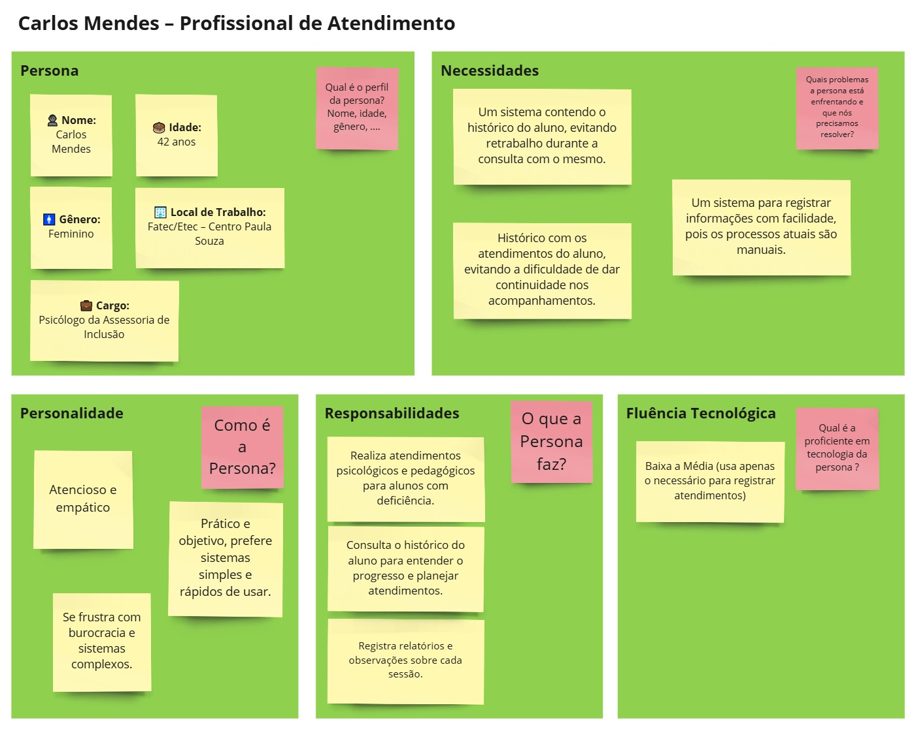

  Fonte: Material produzido pelos autores (2025).

- **Nome:** Carlos Mendes

- **Idade:** 42 anos

- **Cargo:** Psicólogo da Assessoria de Inclusão

- **Local de Trabalho:** Fatec/Etec – Centro Paula Souza

- **Proficiência em Tecnologia:** Baixa a Média (usa apenas o necessário para registrar atendimentos)

#### **Necessidades**
- Um sistema contendo o histórico do aluno, evitando retrabalho durante a consulta com o mesmo.

- Histórico com os atendimentos do aluno, evitando a dificuldade de dar continuidade nos acompanhamentos.

- Um sistema para registrar informações com facilidade, pois os processos atuais são manuais.

#### **Como é o Carlos Mendes?**
- Atencioso e empático, pois lida diretamente com alunos com deficiência.

- Prático e objetivo, prefere **sistemas simples e rápidos** de usar.

- Se frustra com **processos burocráticos e sistemas complexos**.

#### **O que Carlos Mendes faz?**
- Realiza atendimentos psicológicos e pedagógicos para alunos com deficiência.

- Consulta o histórico do aluno para entender o progresso e planejar atendimentos.

- Registra relatórios e observações sobre cada sessão.

### Jornada de Usuário do Carlos Mendes (Profissional de Atendimento)

  Figura X - Jornada de Usuário do Carlos Mendes   

  

  Fonte: Material produzido pelos autores (2025).

**Objetivo:** Realizar atendimentos eficientes, registrando informações de forma rápida e acessível.

#### Jornada Passo a Passo

1. **Receber notificação de um novo aluno vinculado**
    - O coordenador vincula um novo aluno ao profissional.

    - **Com a solução:** O sistema notifica Carlos automaticamente sobre a nova atribuição.

2. **Acessar o sistema e visualizar os alunos atendidos**
    - Faz login na plataforma e acessa sua lista de alunos vinculados.

    - **Com a solução:** O sistema apresenta um dashboard claro com filtros úteis.

3. **Consultar o histórico do aluno antes do atendimento**
    - Antes da sessão, acessa o perfil do aluno para entender suas necessidades.

    - **Com a solução:** O sistema mostra um resumo prático do histórico e demandas do aluno.

4. **Realizar o atendimento e registrar observações**
    - Durante a sessão, anota informações relevantes sobre o atendimento.

    - **Com a solução:** O sistema permite registros rápidos e autosave para evitar perda de dados.

5. **Atualizar evolução do aluno**

    - Com base no progresso, registra novas ações e próximos passos.

    - **Com a solução:** O sistema organiza os registros em uma linha do tempo para facilitar consultas futuras.

6. **Finalizar e revisar os atendimentos do dia**
    - No final do dia, confere e revisa os atendimentos registrados.

    - **Com a solução:** Garante que todas as informações foram salvas e podem ser acessadas pela equipe.

### **Pontos de Contato e Desafios**

**Ponto de contato:** Sistema Gallaudet como ferramenta principal de registro de atendimentos.

**Desafio:** Antes, os profissionais precisavam armazenar informações manualmente ou usar documentos avulsos.

**Solução:** O sistema padroniza e centraliza os registros, agilizando o processo.
  

### Persona 3 - Fernanda Rocha – Gestora Administrativa

  Figura X - Persona Fernanda Rocha  

  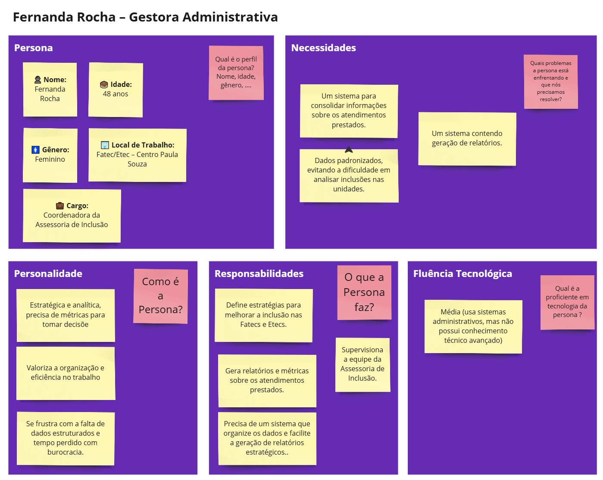

  Fonte: Material produzido pelos autores (2025).

**Nome:** Fernanda Rocha

**Idade:** 48 anos

**Cargo:** Coordenadora da Assessoria de Inclusão

**Local de Trabalho:** Fatec/Etec – Centro Paula Souza

**Proficiência em Tecnologia:** Média (usa sistemas administrativos, mas não tem conhecimento técnico avançado)

#### **Necessidades**
- Um sistema para consolidar informações sobre os atendimentos prestados.

- Dados padronizados, evitando a dificuldade em analisar inclusões nas unidades.

- Um sistema contendo geração de relatórios.

#### **Como é a Fernanda Rocha?**
- Estratégica e analítica, precisa de **métricas para tomar decisões**.

- Valoriza a **organização e eficiência** no trabalho.

- Se frustra com a falta de dados estruturados e tempo perdido com burocracia.

#### **O que Fernanda Rocha faz?**
- Supervisiona a equipe da Assessoria de Inclusão.

- Gera relatórios e métricas sobre os atendimentos prestados.

- Define estratégias para melhorar a inclusão nas Fatecs e Etecs.

- Precisa de um sistema que organize os dados e facilite a geração de relatórios estratégicos.

### Jornada de Usuário da Fernanda Rocha (Gestora Administrativa)

  Figura X - Jornada de Usuário do Carlos Mendes   

  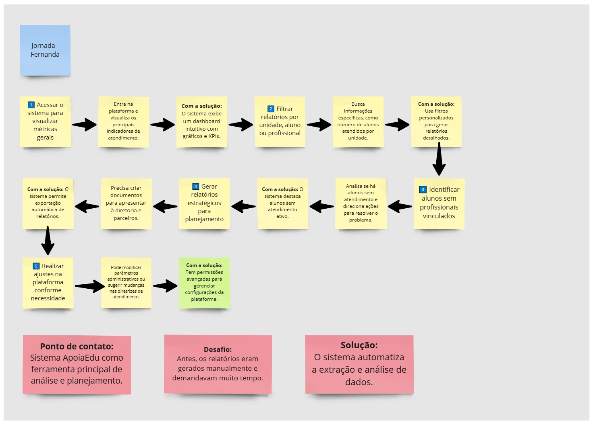

  Fonte: Material produzido pelos autores (2025).

**Objetivo:** Realizar atendimentos eficientes, registrando informações de forma rápida e acessível.

#### Jornada Passo a Passo

1. **Acessar o sistema para visualizar métricas gerais**
    - Entra na plataforma e visualiza os principais indicadores de atendimento.

    - **Com a solução:** O sistema exibe um dashboard intuitivo com gráficos e KPIs.

2. **Filtrar relatórios por unidade, aluno ou profissional**
    - Busca informações específicas, como número de alunos atendidos por unidade.

    - **Com a solução:** Usa filtros personalizados para gerar relatórios detalhados.

3. **Identificar alunos sem profissionais vinculados**
    - Analisa se há alunos sem atendimento e direciona ações para resolver o problema.

    - **Com a solução:** O sistema destaca alunos sem atendimento ativo.

4. **Gerar relatórios estratégicos para planejamento**
    - Precisa criar documentos para apresentar à diretoria e parceiros.

    - **Com a solução:** O sistema permite exportação automática de relatórios.

5. **Realizar ajustes na plataforma conforme necessidade**
    - Pode modificar parâmetros administrativos ou sugerir mudanças nas diretrizes de atendimento.

    - **Com a solução:** Tem permissões avançadas para gerenciar configurações da plataforma.

#### **Pontos de Contato e Desafios**

**Ponto de contato:** Sistema Gallaudet como ferramenta principal de análise e planejamento.

**Desafio:** Antes, os relatórios eram gerados manualmente e demandavam muito tempo.

**Solução:** O sistema automatiza a extração e análise de dados.

 

## 2.5 Modelagem do Fluxo de Negócio
&emsp;Fluxo de nogócio consiste em um conjunto de atividades e decisões que uma organização executa para atingir seus objetivos estratégicos. Ao definir o fluxo de negócio, a equipe consegue entender e otimizar processos, identificar obstáculos e melhorar a comunicação entre os envolvidos.

&emsp;Nesse contexto, a seguir há, em formato de fluxograma, o fluxo de negócio identificado para o presente projeto:

  Figura X - Fluxo de Negócio   

  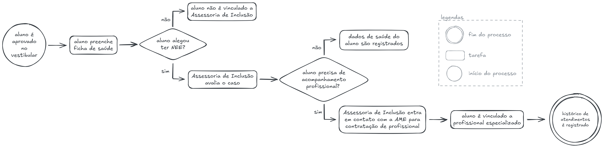

  Fonte: Material produzido pelos autores (2025).

&emsp;Em comparação com o fluxo atual, o proposto modifica apenas a forma como os históricos dos alunos são registrados. Enquanto, atualmente, essa informação é armazenada em diferentes planilhas, com o Sistema Gallaudet o registro de novos atendimentos se torna mais simples e eficiente, além de centralizado. Essa mudança na ferramenta de gestão impactaria tanto os profissionais envolvidos quanto os alunos atendidos pela Assessoria de Inclusão, uma vez que evitaria a perda de dados, facilitando análises e reduzindo erros.

## 2.6 Matriz de Risco do Projeto
## Ameaças
&emsp;Nesta seção, apresentamos a Matriz de Risco do projeto, a matriz de risco tem como objetivo identificar, avaliar e priorizar as ameaças que podem impactar o desenvolvimento e a implementação do sistema. Ao mapear esses riscos, é possível definir estratégias e planos de ação para mitigá-los, garantindo uma gestão eficaz a para a continuidade e o sucesso do projeto.

  Figura X - Matriz de riscos   

  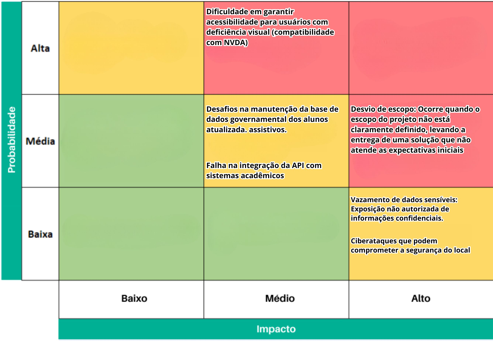

  Fonte: Material produzido pelos autores (2025).

- **Desvio de escopo**:
  Ocorre quando o escopo do projeto não está claramente definido, levando à entrega de uma solução que não atende as expectativas iniciais.

- **Vazamento de dados sensíveis**:
  Exposição não autorizada de informações confidenciais, resultando em danos à privacidade e possíveis penalidades legais.

- **Ciberataques que podem comprometer a segurança do local**:
  A invasão de sistemas por hackers pode comprometer a integridade dos dados e a segurança física das instalações.

- **Dificuldade em garantir acessibilidade para usuários com deficiência visual**:
  O desenvolvimento realizando todas as implementações capazes de atender usuários com dificuldades em engexar pode ser muito complexo.

- **Desafios na manutenção da base de dados dos alunos atualizada**:
  Se a base de dados governamental não for atualizada corretamente, pode haver informações desatualizadas sobre os alunos e seus recursos assistivos.

- **Falha na integração da API com sistemas acadêmicos**:
  Como não temos acesso ao banco de dados governamental de forma direta, haverá a criação de um banco de dados e uma API simulando o acesso ao banco governamental. Podendo ter uma dificuldade em uma integração genuína.

### Plano de Ação - Ameaças
- Implementar uma gestão rigorosa de requisitos, documentando e validando todas as alterações junto aos stakeholders.
- Implementar políticas de controle de acesso baseadas em privilégios mínimos e realizar auditorias frequentes.
- Utilizar ferramentas de segurança digital, como antivírus e firewall.
- Garantir compatibilidade com leitores de tela, testar a aplicação com usuários reais e seguir as diretrizes WCAG.
- Orientar os stakeholders periodicamente sobre a importância de manter a base de dados governamental atualizada.
- Alinhar com a equipe técnica do Centro Paula Souza todos os critérios para que ocorra um acesso correto do banco de dados real do governo.

## Oportunidades
&emsp;A Matriz de Oportunidades destaca os potenciais benefícios que podem ser explorados ao longo do projeto ou em futuras atualizações.

  Figura X - Matriz de oportunidades   

  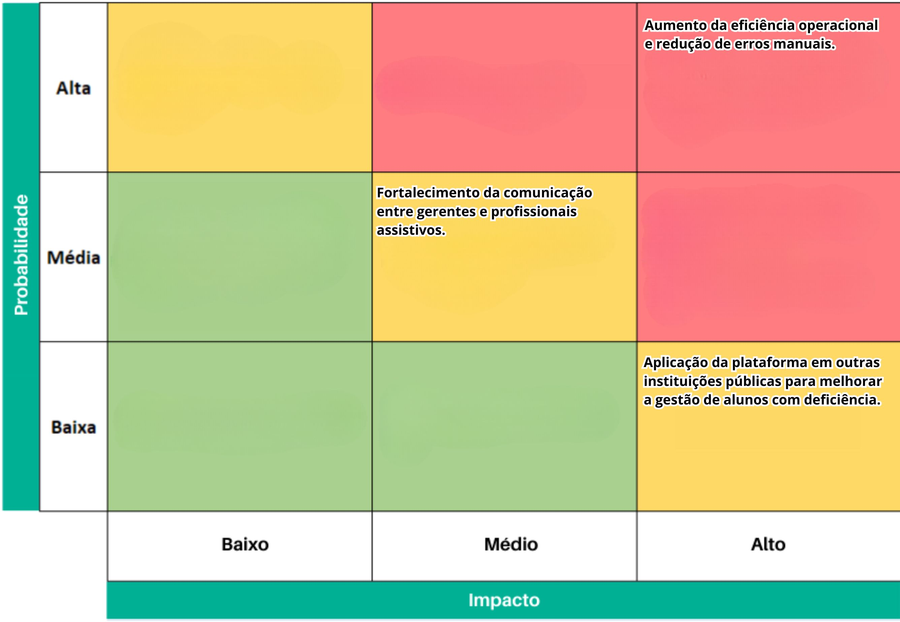

  Fonte: Material produzido pelos autores (2025).

- Se a plataforma for bem-sucedida no Centro Paula Souza, poderá ser replicada em outras instituições públicas para melhorar a gestão de alunos com deficiência.
- **Aumento da eficiência operacional e redução de erros manuais**:
  A automação do processo de cadastro e gestão de alunos com deficiência reduz erros manuais e otimiza o tempo dos gestores, tornando a operação mais eficiente.
- **Fortalecimento da comunicação entre gerentes e profissionais assistivos**:
  Melhorar a comunicação entre os usuários da aplicação e os alunos da instituição facilita a colaboração e a resolução rápida de problemas.

## 2.7 Ideação
_conteúdo_

## 2.7.1 Brainstorming de features
&emsp; O brainstorming de features (funcionalidades) foi realizado com base no problema central do projeto: a necessidade de organizar e gerenciar os atendimentos da Assessoria de Inclusão do Centro Paula Souza (CPS). O objetivo foi identificar funcionalidades que não apenas resolvessem os problemas atuais, como a falta de organização e rastreabilidade dos atendimentos, mas também agregassem valor ao produto, como a geração de relatórios estatísticos e a integração com sistemas existentes. As features foram pensadas para garantir que a solução seja **acessível**, **escalável** e em **conformidade com a LGPD**, atendendo às **necessidades dos servidores, alunos e profissionais envolvidos**.

&emsp; Durante o brainstorming, foram consideradas features essenciais, como o **cadastro de alunos via API, a gestão de atendimentos e a lista de tecnologias assistivas**, além de funcionalidades complementares, como **notificações e dashboards de gestão**. A ideia foi cobrir todos os aspectos do problema, desde o registro básico de dados até a análise avançada e a comunicação eficiente entre os envolvidos. O resultado é uma lista abrangente de features que servirá como base para o desenvolvimento da solução.

| **Feature**                                      | **Descrição**                                                                                   |
|--------------------------------------------------|-------------------------------------------------------------------------------------------------|
| **Filtros e Buscas Avançadas**                   | Filtros por unidade, curso, tipo de necessidade especial, status de atendimento, etc.           |
| **Dashboard de Informações dos Alunos**          | Visualização centralizada de dados dos alunos cadastrados.                                      |
| **Cadastro de Gerente Geral e Gerente de Unidade**| Cadastro de gerentes com diferentes níveis de acesso e responsabilidades.                      |
| **Cadastro de Alunos via API + Validação de Dados**| Integração com sistemas acadêmicos governamentais para cadastro automático, com validação dos dados.          |
| **Cadastro de Unidade de Ensino**                | Cadastro de unidades de ensino (Etecs e Fatecs) com informações detalhadas.               |
| **Registro de Ações no Sistema (Logs)**          | Registro de quem fez, o que fez e quais dados foram alterados no sistema.                       |
| **Gestão de Profissionais**                      | Cadastro de profissionais e vínculo com alunos, com datas de início e fim de atendimento.       |
| **Gestão de Atendimentos**                       | Registro de data e hora de início e fim, tipo de atendimento e profissional responsável.        |
| **Histórico Completo do Aluno**                  | Visualização de atendimentos, tecnologias assistivas utilizadas e profissionais vinculados.     |
| **Lista de Tecnologias Assistivas**              | Lista organizada de tecnologias disponíveis, com descrições detalhadas.                        |
| **Notificações**                                 | Envio de notificações para responsáveis e profissionais sobre atendimentos e prazos.            |
| **Status de Atendimento**                        | Indicador visual (ativo, em espera, concluído) do status do atendimento do aluno.               |
| **Timeline do Aluno**                            | Linha do tempo com todos os eventos e atendimentos relacionados ao aluno.                       |
| **Relatórios e Estatísticas**                    | Geração de relatórios sobre tipos de atendimentos, necessidades atendidas, origem dos alunos, etc. |
| **Exportação de Dados de Alunos**                | Exportação de dados de alunos para planilhas (CSV ou Excel) para análise externa.               |

## 2.7.2 Sequenciamento/Priorização de entregas
&emsp; O sequenciamento e a priorização das entregas foram definidos com base em critérios claros e lógicos, como **impacto no problema central** e **dependências técnicas**. O objetivo foi garantir que o **MVP (Minimum Viable Product)** seja entregue dentro do prazo de **70 dias**, com funcionalidades que resolvam os problemas mais urgentes da Assessoria de Inclusão. As features foram organizadas em sprints, começando pela base do sistema (cadastros essenciais) e evoluindo para funcionalidades mais complexas, como a gestão de atendimentos e a geração de relatórios.

### **Critérios de Priorização**
1. **Impacto no Problema Central**:
   - Features que resolvem diretamente o problema de gestão de atendimentos e cadastro de alunos foram priorizadas.
2. **Dependências Técnicas**:
   - Features que dependem de outras para funcionar foram sequenciadas após a implementação das bases.
3. **Conformidade Legal e Acessibilidade**:
   - Features relacionadas à segurança, LGPD e acessibilidade foram priorizadas desde o início.
4. **Valor Agregado**:
   - Features que agregam valor ao produto, mas não são urgentes, foram deixadas para as sprints finais.
5. **Complexidade de Implementação**:
   - Features mais simples e de rápida implementação foram priorizadas para entregar valor rapidamente.

### **Sequenciamento das Entregas**
#### **Sprint 1 – Entendimento do Problema e Definição de Requisitos**
- **Atividades**:
  1. **Entendimento do Problema**:
     - Reuniões com stakeholders para alinhamento de expectativas.
     - Análise do problema atual da Assessoria de Inclusão.
  2. **Definição de Personas**:
     - Identificação das personas principais (servidores, alunos, responsáveis, profissionais).
  3. **Definição de Requisitos Funcionais (RFs) e Não Funcionais (RNFs)**:
     - Elaboração dos requisitos funcionais e não funcionais do sistema.
  4. **Brainstorming de Features**:
     - Identificação e priorização das features necessárias para o MVP.

- **Justificativa**:
  - A Sprint 1 é crucial para garantir que todos os envolvidos tenham um entendimento claro do problema, das necessidades do negócio e das expectativas dos usuários. A definição de personas, requisitos e features servirá como base para o desenvolvimento nas sprints seguintes.

#### **Sprint 2 – Base do Sistema e Cadastros Essenciais**
- **Features Prioritárias**:

  5. **Cadastro de Gerente Geral e Gerente de Unidade**:
     - Definição de níveis de acesso e responsabilidades.
  6. **Cadastro de Unidade de Ensino**:
     - Cadastro de unidades (Etecs, Fatecs) com informações básicas.
  7. **Cadastro de Alunos via API + Validação de Dados**:
     - Integração com sistemas acadêmicos para cadastro automático e validação de dados.

- **Justificativa**:
  - Essas features são a base do sistema, permitindo que outras funcionalidades sejam construídas sobre elas. O cadastro de alunos, unidades e gerentes é essencial para o funcionamento do sistema.

#### **Sprint 3 – Gestão de Dados e Atendimentos**
- **Features Prioritárias**:

  8. **Dashboard de Informações dos Alunos**:
     - Visualização centralizada de dados dos alunos cadastrados.
  9. **Filtros e Buscas Avançadas**:
     - Filtros por unidade, curso, tipo de necessidade especial, status de atendimento, etc.
  10. **Gestão de Profissionais**:
     - Cadastro de profissionais e vínculo com alunos, com datas de início e fim de atendimento.
  11. **Gestão de Atendimentos**:
     - Registro de data e hora de início e fim, tipo de atendimento e profissional responsável.

- **Justificativa**:
  - Essas features permitem a visualização e organização dos dados, além de iniciar a gestão de profissionais e atendimentos, que são o cerne do projeto. O dashboard e os filtros facilitam a navegação e a análise dos dados.

#### **Sprint 4 – Histórico, Tecnologias Assistivas e Logs**
- **Features Prioritárias**:

  12. **Histórico Completo do Aluno**:
     - Visualização de atendimentos, tecnologias assistivas utilizadas e profissionais vinculados.
  13. **Lista de Tecnologias Assistivas**:
     - Lista organizada de tecnologias disponíveis, com descrições detalhadas.
  14. **Status de Atendimento**:
      - Indicador visual (ativo, em espera, concluído) do status do atendimento do aluno.
  15. **Registro de Ações no Sistema (Logs)**:
      - Registro de quem fez, o que fez e quais dados foram alterados no sistema.

- **Justificativa**:
  - Essas features complementam a gestão de atendimentos, fornecendo informações detalhadas e status atualizados. Os logs garantem conformidade com a LGPD e auditoria das ações.

#### **Sprint 5 – Funcionalidades Avançadas e Finalização**
- **Features Prioritárias**:

  16. **Timeline do Aluno**:
      - Linha do tempo com todos os eventos e atendimentos relacionados ao aluno.
  17. **Notificações**:
      - Envio de notificações para responsáveis e profissionais sobre atendimentos e prazos.
  18. **Relatórios e Estatísticas**:
      - Geração de relatórios sobre tipos de atendimentos, necessidades atendidas, origem dos alunos, etc.
  19. **Exportação de Dados de Alunos**:
      - Exportação de dados de alunos para planilhas (CSV ou Excel).

- **Justificativa**:
  - Essas features agregam valor ao produto, melhorando a experiência do usuário e a eficiência da comunicação. A timeline e as notificações trazem mais clareza e organização, enquanto os relatórios e a exportação de dados facilitam a análise e o compartilhamento de informações.

### **Tabela de Sequenciamento de Entregas**

| **Sprint** | **Features Prioritárias**                                                                 | **Justificativa**                                                                 |
|------------|------------------------------------------------------------------------------------------|-----------------------------------------------------------------------------------|
| **Sprint 2** | Cadastro de Gerente Geral e Gerente de Unidade, Cadastro de Unidade de Ensino, Cadastro de Alunos via API + Validação de Dados | Base do sistema, permitindo que outras funcionalidades sejam construídas sobre elas. |
| **Sprint 3** | Dashboard de Informações dos Alunos, Filtros e Buscas Avançadas, Gestão de Profissionais, Gestão de Atendimentos | Visualização e organização dos dados, além de iniciar a gestão de profissionais e atendimentos. |
| **Sprint 4** | Histórico Completo do Aluno, Lista de Tecnologias Assistivas, Status de Atendimento, Registro de Ações no Sistema (Logs) | Complementam a gestão de atendimentos com informações detalhadas e garantem conformidade com a LGPD. |
| **Sprint 5** | Timeline do Aluno, Notificações, Relatórios e Estatísticas, Exportação de Dados de Alunos | Agregam valor ao produto, melhorando a experiência do usuário e a eficiência da comunicação. |

## 2.8 Canvas do Projeto
&emsp;Canvas MVP é uma ferramenta utilizada para alinhar ideias e definir estratégias. Durante sua elaboração, é discutido o entendimento da equipe sobre a proposta apresentada e, assim, as principais características da solução são dispostas em um quadro, colaborando para um alinhamento mais eficiente entre os integrantes da equipe.

&emsp;Nesse contexto, foi realizado um Canvas MVP com base na proposta trazida pelo Centro Paula Souza. Nele, estão identificados os pontos mais importantes levantados pela equipe sobre o projeto Gallaudet:

  Figura X - Canvas MVP  

  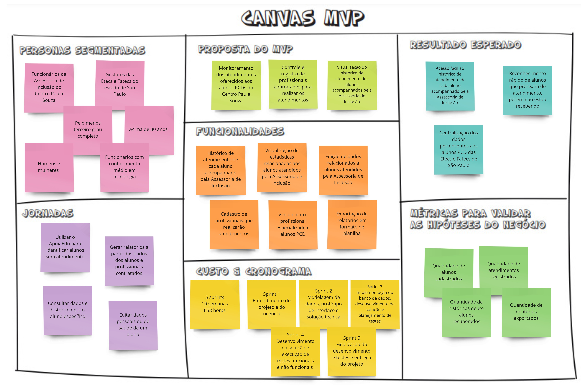

  Fonte: Material produzido pelos autores (2024).

# 3. Requisitos do Projeto
&emsp;Para garantir que o sistema **Gallaudet** atenda às necessidades dos usuários e funcione de maneira eficiente, é importante definir claramente seus requisitos.

&emsp;Os **Requisitos Funcionais (RFs)** descrevem o que o sistema deve fazer, ou seja, suas principais funcionalidades, como o cadastro de usuários, a gestão de atendimentos e a exibição de informações relevantes. Cada um desses requisitos está associado a testes que garantem sua correta implementação e funcionamento.

&emsp;Além dos RFs, temos os **Requisitos Não Funcionais (RNFs)**, que especificam como o sistema deve se comportar. Eles abordam aspectos como segurança, desempenho, usabilidade e conformidade com normas, garantindo que o sistema seja robusto, acessível e confiável.

&emsp;Por fim, há uma correlação entre RFs e RNFs, pois um requisito funcional pode depender de um requisito não funcional para ser eficaz. Por exemplo, um sistema pode permitir o cadastro de usuários (RF), mas precisa seguir regras de segurança e privacidade (RNF) para proteger os dados.

&emsp;A seguir, detalharemos todos esses requisitos, assegurando que o Gallaudet seja desenvolvido com qualidade, segurança e alinhado às expectativas dos usuários.

## 3.1 Requisitos Funcionais (RFs)

| ID   | Título                               | Descrição do Requisito Funcional                                                                                                                                                                                                                                                                                                                                                                                                                   |
| ---- | ------------------------------------ | -------------------------------------------------------------------------------------------------------------------------------------------------------------------------------------------------------------------------------------------------------------------------------------------------------------------------------------------------------------------------------------------------------------------------------------------------- |
| RF01 | Cadastro de Gerentes                 | O sistema deve permitir o cadastro de Gerente Geral e Gerente de Unidade. &emsp;**Detalhamento:** &emsp;- Apenas administradores podem cadastrar novos gerentes. &emsp;- Deve haver validação dos dados obrigatórios (CPF, e-mail, etc.). |
| RF02 | Cadastro de Unidade de Ensino        | O sistema deve permitir o cadastro de Unidade de Ensino. &emsp;**Detalhamento:** &emsp;- Cadastro com informações como nome, endereço e contato. &emsp;- Essencial para vincular alunos à unidade correta.                                                                                                                                |
| RF03 | Cadastro de Alunos via API           | O sistema deve permitir o cadastro de alunos via API, garantindo a validação de dados. &emsp;**Detalhamento:** &emsp;- Validação de campos obrigatórios (CPF, e-mail, nome). &emsp;- Retorno de mensagens de erro específicas em caso de falhas na validação.                                                                                                                     |
| RF04 | Dashboard de Alunos                  | O sistema deve apresentar um dashboard com informações dos alunos, incluindo filtros e buscas avançadas. &emsp;**Detalhamento:** &emsp;- Exibição de gráficos e indicadores visuais. &emsp;- Filtros por data, status e outras categorias para facilitar a análise dos dados.                                                                                                        |
| RF05 | Gestão de Profissionais              | O sistema deve permitir a gestão de profissionais, incluindo cadastro, edição e exclusão de dados. &emsp;**Detalhamento:** &emsp;- Registro de informações relevantes (especialidade, contato, etc.). &emsp;- Operações de edição e exclusão devem ser auditadas.                                                                                                            |
| RF06 | Gestão de Atendimentos               | O sistema deve permitir a gestão de atendimentos, com inclusão, edição e exclusão de registros. &emsp;**Detalhamento:** &emsp;- Cada atendimento deve registrar data, hora, responsável e descrição. &emsp;- Histórico dos atendimentos deve ser mantido para auditoria.                                                                                  |
| RF07 | Registro de Logs                     | O sistema deve registrar logs das ações dos usuários. &emsp;**Detalhamento:** &emsp;- Registra data, hora, usuário e ação realizada. &emsp;- Essencial para rastreabilidade e auditoria das operações.                                                                                                                     |
| RF08 | Histórico Completo do Aluno          | O sistema deve permitir a visualização do histórico completo do aluno. &emsp;**Detalhamento:** &emsp;- Consolida todas as interações, atendimentos e alterações no perfil do aluno. &emsp;- Facilita a análise do percurso e evolução do aluno.                                                                                                                  |
| RF09 | Consulta de Tecnologias Assistivas   | O sistema deve permitir a listagem e consulta de tecnologias assistivas disponíveis para os alunos. &emsp;**Detalhamento:** &emsp;- Permite busca por categoria ou características específicas. &emsp;- Auxilia na seleção da tecnologia mais adequada às necessidades do aluno.                                                             |
| RF10 | Atualização de Status de Atendimento | O sistema deve permitir a atualização do status de atendimento dos alunos. &emsp;**Detalhamento:** &emsp;- Possibilita alteração do status (ex: em andamento, concluído, cancelado). &emsp;- Atualização deve ser refletida no histórico e, se necessário, notificada aos usuários.                                                                              |
| RF11 | Exibição da Timeline do Aluno        | O sistema deve exibir uma timeline do aluno com todos os registros de atendimentos e evoluções. &emsp;**Detalhamento:** &emsp;- Apresenta os registros de forma cronológica. &emsp;- Permite visualização detalhada de cada evento mediante seleção.                                                                                                          |
| RF12 | Envio de Notificações                | O sistema deve enviar notificações aos usuários sobre eventos relevantes, como novos atendimentos. &emsp;**Detalhamento:** &emsp;- Notificações podem ser enviadas por e-mail, push ou outro meio configurável. &emsp;- Mantém os usuários informados para ações imediatas em eventos críticos.                                                                       |

### Testes de Validação dos Requisitos Funcionais
| ID   | Teste | Pré-condição | Procedimento | Resultado Esperado | Pós-condição |
| ---- | ----- | ----------- | ------------ | ------------------ | ------------ |
| RF01 | Criar Gerente | O usuário deve ter permissões de administrador. | Acessar a tela de cadastro, preencher os dados obrigatórios e confirmar. | O gerente é cadastrado e aparece na listagem. | O novo gerente pode acessar o sistema conforme suas permissões. |
| RF02 | Criar Unidade de Ensino | O usuário deve estar autenticado e ter permissões adequadas. | Acessar a tela de cadastro, inserir os dados necessários e confirmar. | A unidade é cadastrada e aparece na listagem. | A unidade pode ser associada a alunos. |
| RF03 | Cadastro de Aluno via API | O serviço de API deve estar disponível. | Enviar uma requisição POST com dados válidos. | O aluno é cadastrado e pode ser recuperado via API. | O aluno fica disponível para consulta e edição. |
| RF04 | Consulta no Dashboard | O banco de dados deve conter registros de alunos. | Acessar o dashboard e aplicar filtros de pesquisa. | O sistema retorna os dados corretos conforme os filtros aplicados. | O usuário pode visualizar e interagir com os dados retornados. |
| RF05 | Gestão de Profissionais | O usuário deve ter permissões para gerenciar profissionais. | Acessar a tela de gestão, cadastrar um profissional e salvar. | O profissional é cadastrado e listado no sistema. | O profissional pode ser editado ou excluído posteriormente. |
| RF06 | Gestão de Atendimentos | O aluno e o profissional devem estar cadastrados no sistema. | Criar um novo atendimento, preencher os dados e salvar. | O atendimento fica registrado e pode ser acessado posteriormente. | O atendimento pode ser editado ou excluído. |
| RF07 | Registro de Logs | O sistema deve estar operando normalmente. | Executar ações como cadastro, edição ou exclusão de registros. | O sistema armazena os logs corretamente com data, usuário e ação realizada. | Os logs podem ser consultados por usuários autorizados. |
| RF08 | Histórico do Aluno | O aluno deve possuir atendimentos registrados. | Acessar o perfil do aluno e visualizar o histórico. | O histórico exibe todas as interações e atendimentos registrados. | O usuário pode utilizar as informações do histórico para futuras ações. |
| RF09 | Consulta de Tecnologias Assistivas | O sistema deve ter tecnologias cadastradas. | Acessar a listagem e realizar buscas por tecnologia. | O sistema exibe as tecnologias disponíveis corretamente. | As tecnologias podem ser associadas a alunos conforme necessário. |
| RF10 | Atualização de Status de Atendimento | O aluno deve ter um atendimento registrado. | Editar um atendimento e alterar seu status. | O novo status é salvo e reflete no atendimento do aluno. | O status atualizado pode ser consultado no histórico do aluno. |
| RF11 | Exibição da Timeline | O aluno deve possuir registros de atendimento. | Acessar o perfil do aluno e visualizar a timeline. | A timeline exibe os registros de forma cronológica. | O usuário pode utilizar os dados para análise e acompanhamento. |
| RF12 | Envio de Notificações | O usuário deve estar cadastrado e com notificações ativadas. | Criar um novo atendimento ou evento relevante. | O sistema dispara uma notificação para os usuários envolvidos. | Os usuários são informados e podem tomar ações necessárias. |

## 3.2 Requisitos Não Funcionais (RNFs)
&emsp;Os requisitos não funcionais descrevem as características do sistema que não estão diretamente relacionadas às funcionalidades, mas são essenciais para o desempenho, segurança, usabilidade e conformidade com normas e leis. Cada RNF está alinhado com a **ISO 25010**, que define critérios de qualidade para software.

| **ID**    | **Descrição**                                                                                                                                                                                                                   | **Teste Associado** |
|-----------|---------------------------------------------------------------------------------------------------------------------------------------------------------------------------------------------------------------------------------|---------------------|
| **RNF01** | **Acessibilidade**: O sistema deve ser acessível, com suporte a leitores de tela, para garantir que usuários com deficiência visual possam utilizar todas as funcionalidades sem dificuldades. (Conformidade com ISO 25010 - Usabilidade). | Teste de Acessibilidade |
| **RNF02** | **Portabilidade**: O sistema deve ser desenvolvido em nuvem e ser agnóstico de provedor, permitindo que ele seja implantado em diferentes ambientes de nuvem (ex: AWS, Azure, Google Cloud) sem necessidade de alterações significativas. (Conformidade com ISO 25010 - Portabilidade). | Teste de Implantação em Nuvem |
| **RNF03** | **Segurança de Dados**: O sistema deve garantir o tratamento de dados em conformidade com a **Lei Geral de Proteção de Dados (LGPD)**, incluindo criptografia de dados sensíveis, controle de acesso e auditoria de operações. (Conformidade com ISO 25010 - Segurança). | Teste de Segurança de Dados |
| **RNF04** | **Confiabilidade**: O sistema deve registrar logs de todas as ações realizadas, incluindo informações sobre o usuário, a ação realizada e os dados alterados. Esses logs devem ser armazenados de forma segura e estar disponíveis para auditoria. (Conformidade com ISO 25010 - Confiabilidade). | Teste de Logs |
| **RNF05** | **Desempenho**: O sistema deve ter um tempo de resposta inferior a **2 segundos** para **95% das requisições**, mesmo sob carga normal de uso. Isso inclui operações como cadastro de alunos, consulta de histórico e geração de relatórios. (Conformidade com ISO 25010 - Desempenho). | Teste de Desempenho |
| **RNF06** | **Disponibilidade**: O sistema deve garantir uma disponibilidade de **99,9%**, com mecanismos de redundância e recuperação de falhas para evitar tempo de inatividade não planejado. (Conformidade com ISO 25010 - Confiabilidade). | Teste de Disponibilidade |
| **RNF07** | **Escalabilidade**: O sistema deve ser capaz de escalar horizontalmente para suportar um aumento no número de usuários e requisições sem degradação do desempenho. (Conformidade com ISO 25010 - Desempenho). | Teste de Escalabilidade |
| **RNF08** | **Manutenibilidade**: O código do sistema deve ser modular e bem documentado, seguindo boas práticas de desenvolvimento (ex: Clean Code, SOLID), para facilitar a manutenção e a evolução do software. (Conformidade com ISO 25010 - Manutenibilidade). | Teste de Revisão de Código |
| **RNF09** | **Interoperabilidade**: O sistema deve ser capaz de se integrar com outros sistemas acadêmicos do CPS via APIs padronizadas (ex: RESTful APIs), garantindo a troca de dados de forma eficiente e segura. (Conformidade com ISO 25010 - Funcionalidade). | Teste de Integração de APIs |
| **RNF10** | **Usabilidade**: A interface do sistema deve ser intuitiva e fácil de usar, com design responsivo que funcione bem em diferentes dispositivos (desktop, tablet, mobile). (Conformidade com ISO 25010 - Usabilidade). | Teste de Usabilidade |

### **Detalhamento dos RNFs**

#### **RNF01 – Acessibilidade**
- **Descrição**: O sistema deve ser compatível com leitores de tela, como NVDA ou JAWS, para garantir que usuários com deficiência visual possam navegar e utilizar todas as funcionalidades sem dificuldades.
- **Teste Associado**: Realizar testes de navegação com leitores de tela para garantir que todos os elementos da interface sejam descritos corretamente.

#### **RNF02 – Portabilidade**
- **Descrição**: O sistema deve ser desenvolvido para ser implantado em qualquer ambiente de nuvem (AWS, Azure, Google Cloud) sem necessidade de alterações significativas. Isso inclui o uso de containers (ex: Docker) e orquestração (ex: Kubernetes).
- **Teste Associado**: Realizar a implantação do sistema em diferentes provedores de nuvem e verificar se ele funciona corretamente.

#### **RNF03 – Segurança de Dados**
- **Descrição**: O sistema deve seguir as diretrizes da LGPD, incluindo criptografia de dados sensíveis (ex: dados pessoais de alunos), controle de acesso baseado em roles (RBAC) e auditoria de todas as operações realizadas no sistema.
- **Teste Associado**: Realizar testes de segurança para verificar a criptografia de dados, o controle de acesso e a geração de logs de auditoria.

#### **RNF04 – Confiabilidade**
- **Descrição**: O sistema deve registrar logs detalhados de todas as ações realizadas, incluindo informações sobre o usuário, a ação realizada e os dados alterados. Esses logs devem ser armazenados de forma segura e estar disponíveis para auditoria.
- **Teste Associado**: Verificar se os logs são gerados corretamente e se estão armazenados de forma segura.

#### **RNF05 – Desempenho**
- **Descrição**: O sistema deve garantir um tempo de resposta inferior a 2 segundos para 95% das requisições, mesmo sob carga normal de uso. Isso inclui operações como cadastro de alunos, consulta de histórico e geração de relatórios.
- **Teste Associado**: Realizar testes de carga para medir o tempo de resposta das requisições sob diferentes cenários de uso.

#### **RNF06 – Disponibilidade**
- **Descrição**: O sistema deve garantir uma disponibilidade alta, com mecanismos de redundância e recuperação de falhas para evitar tempo de inatividade não planejado.
- **Teste Associado**: Simular falhas no sistema e verificar se ele se recupera automaticamente sem perda de dados.

#### **RNF07 – Escalabilidade**
- **Descrição**: O sistema deve ser capaz de escalar horizontalmente para suportar um aumento no número de usuários e requisições sem degradação do desempenho.
- **Teste Associado**: Realizar testes de escalabilidade para verificar se o sistema suporta um aumento na carga de trabalho.

#### **RNF08 – Manutenibilidade**
- **Descrição**: O código do sistema deve ser modular e bem documentado, seguindo boas práticas de desenvolvimento (ex: Clean Code, SOLID), para facilitar a manutenção e a evolução do software.
- **Teste Associado**: Realizar revisões de código para garantir que as boas práticas de desenvolvimento sejam seguidas.

#### **RNF09 – Interoperabilidade**
- **Descrição**: O sistema deve ser capaz de se integrar com outros sistemas acadêmicos do CPS via APIs padronizadas (ex: RESTful APIs), garantindo a troca de dados de forma eficiente e segura.
- **Teste Associado**: Realizar testes de integração com APIs externas para garantir a troca de dados.

#### **RNF10 – Usabilidade**
- **Descrição**: A interface do sistema deve ser intuitiva e fácil de usar, com design responsivo que funcione bem em diferentes dispositivos (desktop, tablet, mobile).
- **Teste Associado**: Realizar testes de usabilidade com usuários reais para garantir que a interface seja intuitiva e funcional.

## 3.3 Correlação RFs e RNFs
&emsp;A correlação entre RNFs e RFs garante que os aspectos de qualidade essenciais estejam integrados às funcionalidades, promovendo um sistema robusto e confiável.

| RNF   | Descrição                                                                 | RFs Correlacionados                       | Justificativa                                                                                       |
|-------|---------------------------------------------------------------------------|-------------------------------------------|-----------------------------------------------------------------------------------------------------|
| RNF01 | Acessibilidade: Suporte a leitores de tela.                               | RF01, RF02, RF04, RF05, RF06, RF08, RF09, RF10, RF11, RF12 | Interfaces gráficas devem ser acessíveis a todos os usuários, inclusive os com deficiência visual.   |
| RNF02 | Portabilidade: Implantação em nuvem independente de provedor.             | RF03, RF04, RF05, RF06, RF12                | Funcionalidades via API e dashboards necessitam de uma infraestrutura flexível e adaptável.          |
| RNF03 | Segurança de Dados: Criptografia, controle de acesso e auditoria.         | RF01, RF02, RF03, RF05, RF06, RF07, RF08, RF10, RF12 | Protege dados sensíveis durante cadastros, consultas e atualizações.                                |
| RNF04 | Confiabilidade (Logs): Registro seguro de todas as ações dos usuários.     | RF07                                      | Logs detalhados possibilitam rastrear e auditar as ações realizadas no sistema.                     |
| RNF05 | Desempenho: Resposta em menos de 2 segundos para 95% das requisições.       | RF03, RF04, RF05, RF06                      | Operações intensivas, como APIs e consultas, exigem alta performance para manter a experiência do usuário. |
| RNF06 | Disponibilidade: 99,9% de uptime com redundância e recuperação de falhas.   | Todos os RFs                              | Garante que todas as funcionalidades estejam sempre acessíveis e operacionais.                     |
| RNF07 | Escalabilidade: Suporte ao aumento de usuários sem perda de desempenho.     | RF03, RF04, RF05, RF06, RF12                | Permite a manutenção da performance mesmo com o crescimento do uso do sistema.                     |
| RNF08 | Manutenibilidade: Código modular e bem documentado.                       | Aplicável a todos os RFs                   | Facilita a manutenção, correção de falhas e evolução do sistema.                                   |
| RNF09 | Interoperabilidade: Integração via APIs padronizadas com outros sistemas.   | RF03                                      | Assegura troca de dados eficiente e segura com sistemas externos.                                  |
| RNF10 | Usabilidade: Interface intuitiva e responsiva em diversos dispositivos.     | RF01, RF02, RF04, RF05, RF06, RF08, RF09, RF10, RF11, RF12 | Melhora a experiência do usuário, facilitando a interação com todas as funcionalidades.             |

# 4. Modelagem de Dados
&emsp; A modelagem de dados é um dos principais pontos da solução para a Assessoria de Inclusão do Centro Paula Souza. Com ela, será organizado de forma clara e segura informações essenciais — como alunos, responsáveis, profissionais e tecnologias assistivas — para transformar o atendimento em algo ágil, rastreável e acessível. Desde o respeito à privacidade (LGPD) até a integração com leitores de tela, garantindo que todos os servidores, inclusive aqueles com deficiência visual, possam usar o sistema com autonomia. O modelo foi desenhado para crescer junto com as necessidades do CPS, evitando gargalos e mantendo a simplicidade mesmo com novas demandas.

## 4.1 Modelo Conceitual de Dados

### Entidades, Atributos e Relações

#### 1. **Aluno**
- **Atributos**:
  - `ID` (Chave Primária)
  - `Nome`
  - `DataNascimento`
  - `Unidade_ID` (Chave Estrangeira para `Unidade`)
  - `Curso_ID` (Chave Estrangeira para `Curso`)
  - `AnoMatricula`
  - `DataMatricula`
  - `DataPrevisaoFim`
  - `Turno` (Manhã/Tarde/Noite/Integral/EaD)
  - `NecessitaTecnologia` (Sim/Não)
  - `NecessitaAcompanhamento` (Sim/Não)
  - `Observacoes`
- **Descrição**: Armazena informações acadêmicas e necessidades específicas dos alunos. Suporta **filtros por unidade, curso e status de atendimento**.

#### 2. **Responsavel**
- **Atributos**:
  - `ID` (Chave Primária)
  - `Nome`
  - `Tipo` (Mãe/Pai/Irmão/etc.)
  - `Email`
  - `Telefone1`
  - `Telefone2` (Opcional)
- **Descrição**: Responsáveis legais vinculados aos alunos. Usado para **notificações automáticas**.

#### 3. **Profissional**
- **Atributos**:
  - `ID` (Chave Primária)
  - `Nome`
  - `Email`
  - `Telefone`
  - `Unidade_ID` (Chave Estrangeira para `Unidade`)
- **Descrição**: Profissionais que realizam atendimentos. Vinculados a unidades para **gestão de acesso por gerentes**.

#### 4. **Atendimento**
- **Atributos**:
  - `ID` (Chave Primária)
  - `Aluno_ID` (Chave Estrangeira para `Aluno`)
  - `Profissional_ID` (Chave Estrangeira para `Profissional`)
  - `DataInicio`
  - `DataFimPrevisto`
  - `Status` (Ativo/Em Espera/Concluído)
  - `Observacoes`
- **Descrição**: Registra atendimentos e **status visual**. Base para **Timeline do Aluno** e **relatórios estatísticos**.

#### 5. **TecnologiaAssistiva**
- **Atributos**:
  - `ID` (Chave Primária)
  - `Tipo` (Comunicação Alternativa/Leitor de Tela/etc.)
  - `Descricao`
  - `DataCadastro`
- **Descrição**: Suporta **cadastro flexível de tecnologias** e vinculação a alunos.

#### 6. **NecessidadeEspecial**
- **Atributos**:
  - `ID` (Chave Primária)
  - `Tipo` (Ex.: Deficiência Visual)
- **Descrição**: Categorias editáveis para **filtros avançados**.

#### 7. **Unidade**
- **Atributos**:
  - `ID` (Chave Primária)
  - `Nome`
  - `Tipo` (ETEC/FATEC)
- **Descrição**: Unidades administrativas do CPS. Usado em **cadastro de unidades** e dashboards.

#### 8. **Curso**
- **Atributos**:
  - `ID` (Chave Primária)
  - `Nome`
  - `Tipo` (Nível Médio/Superior)
- **Descrição**: Cursos ofertados. Base para **filtros por curso**.

#### 9. **Usuario**
- **Atributos**:
  - `ID` (Chave Primária)
  - `Nome`
  - `Email`
  - `Perfil` (Gerente Geral/Gerente de Unidade/Servidor)
  - `Unidade_ID` (Chave Estrangeira para `Unidade` - obrigatório para Gerentes de Unidade)
- **Descrição**: Gerencia **níveis de acesso** para **cadastro de gerentes**.

#### 10. **LogUso**
- **Atributos**:
  - `ID` (Chave Primária)
  - `Usuario_ID` (Chave Estrangeira para `Usuario`)
  - `Acao` (Ex.: "Cadastrou aluno")
  - `DadosAlterados` (JSON)
  - `DataHora`
- **Descrição**: Registra **ações no sistema** para auditoria.

### Relações
| **Entidade 1**      | **Entidade 2**          | **Tipo**      | **Descrição**                                                                 |
|----------------------|-------------------------|---------------|-------------------------------------------------------------------------------|
| Aluno                | Responsavel             | 1:1           | Cada aluno tem um responsável principal.                                      |
| Aluno                | Atendimento             | 1:N           | Um aluno pode ter múltiplos atendimentos.                                     |
| Profissional         | Atendimento             | 1:N           | Um profissional pode realizar vários atendimentos.                            |
| Aluno                | TecnologiaAssistiva     | M:N           | Tecnologias podem ser vinculadas a múltiplos alunos (via `AlunoTecnologia`). |
| Aluno                | NecessidadeEspecial     | M:N           | Alunos podem ter múltiplas necessidades (via `AlunoNecessidade`).             |
| Usuario              | Unidade                 | 1:N           | Gerentes de Unidade são vinculados a uma unidade específica.                  |
| Aluno                | Curso                   | N:1           | Múltiplos alunos estão vinculados a um curso específico.                      |
| Usuario              | LogUso                  | 1:N           | Um usuário pode gerar múltiplos registros de log de ações no sistema.         |

## 4.2 Modelo Lógico de Dados

## 4.3 Modelo Físico de Dados
_conteúdo_

**Nota:** Insira uma explicação e direcionamento para o readme.md da pasta database.

# 5. Solução Técnica (Design)
_conteúdo_

## 5.1 Diagrama de Componentes da UML
_conteúdo_

## 5.2 Diagramas de Sequência da UML
_conteúdo_

## 5.3 Descrição Textual dos Diagramas
_conteúdo_

# 6. Mapeamento Técnico de Infraestrutura e Implantação
_conteúdo_

## 6.1 Diagrama de Implantação da UML
_conteúdo_

## 6.2 Justificativa das Escolhas de Implantação
_conteúdo_

## 6.3 Considerações sobre Desempenho e Segurança
_conteúdo_

# 7. Projeto Visual da Solução

&emsp;Esta seção abrange o desenvolvimento dos wireframes e mockups de alta fidelidade, que representam a estrutura e o design visual da solução. Os wireframes estabelecem a organização dos elementos da interface, enquanto os mockups de alta fidelidade detalham o aspecto final da aplicação, incluindo cores, tipografia e componentes visuais.

## 7.1 Desenvolvimento de Wireframes

&emsp; Esta subseção está dividida em duas partes: fluxos e elementos enumerados. A seção de fluxos descreve as telas da solução, suas funções e os principais caminhos de navegação, adotando uma perspectiva macro. Já a parte de elementos enumerados analisa detalhadamente os componentes de cada página e suas respectivas funcionalidades.

### Fluxos

#### Login

&emsp; O fluxo se inicia na página de login, onde o usuário insere suas credenciais para autenticação e acesso à aplicação.

  Figura X - Página de Login  

  

  Fonte: Material produzido pelos autores (2025).

#### Configuração de Listas

&emsp; Após a autenticação, a primeira página exibida contém uma lista e um dashboard de alunos. Entretanto, antes dessa etapa, o usuário pode configurar a lista, selecionando a unidade de ensino desejada e os tipos de informações a serem visualizadas.

  Figura X - FLuxo de Configurações de Listas  

  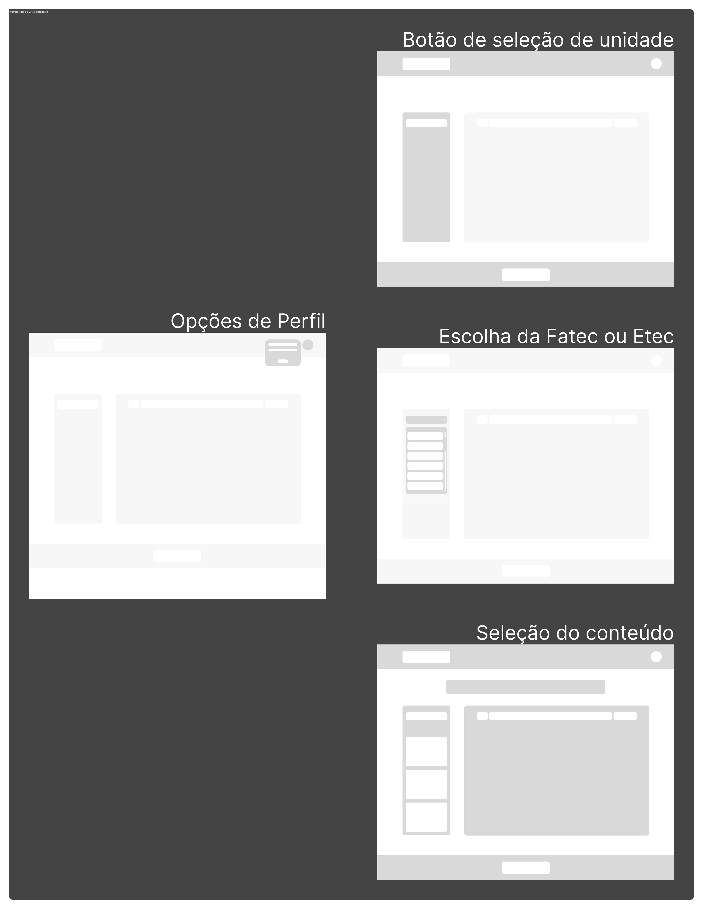

  Fonte: Material produzido pelos autores (2025).

&emsp; O fluxo completo dessa configuração está ilustrado na imagem acima e descrito detalhadamente na seção de elementos enumerados.

#### Fluxo de Alunos

&emsp; O fluxo principal e de maior valor para o cliente é o fluxo de alunos, sendo essa a primeira interface apresentada após o login. A seguir, é possível visualizar as quatro páginas que compõem esse fluxo:

  Figura X - Fluxo de Alunos  

  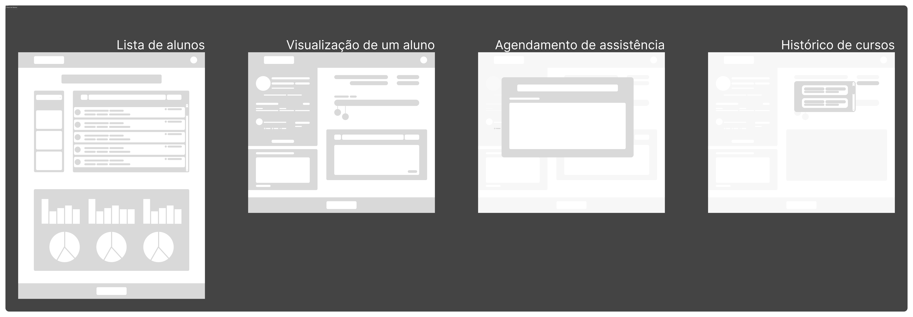

  Fonte: Material produzido pelos autores (2025).

&emsp; O fluxo inicia com uma página que apresenta a lista de alunos e um dashboard centralizando informações sobre a distribuição dos estudantes entre as instituições de ensino. À direita, há uma tela de visualização individual do aluno, acessada ao clicar em um nome na lista. A terceira página contém um modal para agendamento de assistência, permitindo o preenchimento de um formulário com informações detalhadas. Por fim, a última página exibe o histórico acadêmico do aluno.

#### Fluxo de Profissionais

&emsp; O fluxo de profissionais refere-se aos indivíduos que prestam assistência aos alunos. Para acessá-lo, é necessário, na configuração de lista (localizada à esquerda da lista principal), selecionar a opção de exibição de profissionais.

  Figura X - Fluxo de Profissionais  

  

  Fonte: Material produzido pelos autores (2025).

&emsp; Esse fluxo é mais simples que o de alunos, pois não requer um dashboard centralizador, nem envolve etapas como a de criação de um atendimento. À esquerda, há a lista de profissionais, e à direita, a página de visualização detalhada de um profissional, acessível ao clicar em um nome na lista.

#### Fluxo de Usuários

&emsp; O último fluxo, acessível por meio da configuração de lista, refere-se aos usuários do sistema, como gerentes de unidade e gerentes gerais.

  Figura X - Fluxo de Usuários  

  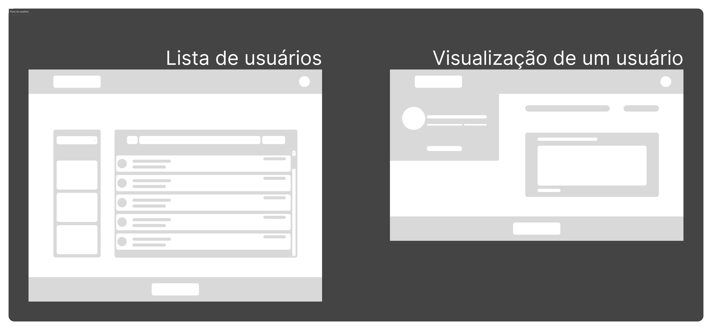

  Fonte: Material produzido pelos autores (2025).

&emsp; Semelhante aos fluxos anteriores, a lista de usuários é apresentada à esquerda e pode ser filtrada por diferentes critérios, principalmente pela unidade de ensino à qual o usuário está vinculado. O acesso às páginas do sistema depende do nível de permissão do usuário. Por exemplo, um gerente de unidade de uma determinada Fatec não pode visualizar dados de outra Fatec. Além disso, apenas gerentes administrativos, que possuem o maior nível de acesso e não estão vinculados a uma unidade específica, podem visualizar a lista completa de usuários. À direita, há a página de visualização individual de um usuário.

 

&emsp; Para uma análise detalhada dos fluxos, com a possibilidade de ampliar as imagens e visualizar indicações específicas, consulte o [documento em PDF](./assets/section7/7.1_wireframe/complete_wireframe.pdf) disponível neste repositório.

 

---

 

### Descrição Enumerada dos Elementos 

#### Login

  Figura X - Wireframe da tela de login  

  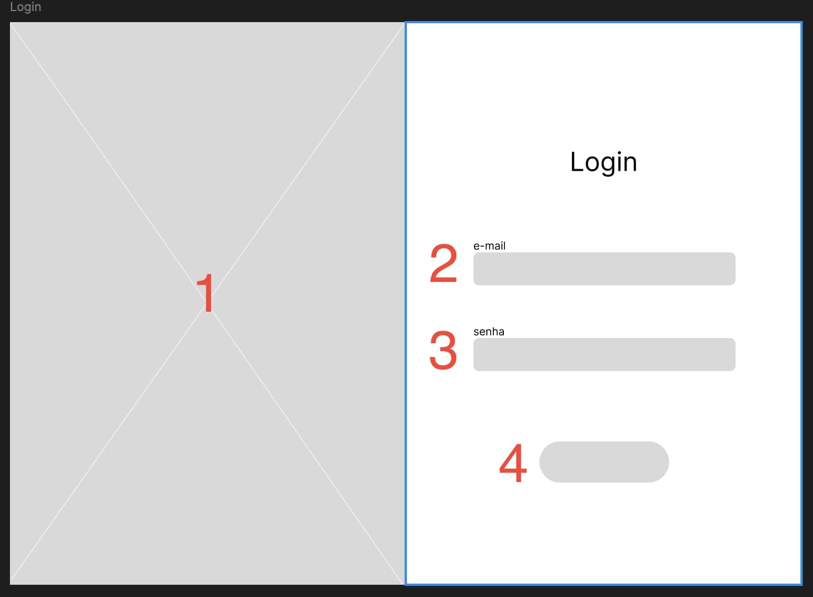

  Fonte: Material produzido pelos autores (2025).

1. **Área de destaque (imagem ou ilustração)**
   Espaço destinado para inserir uma imagem de identidade visual do Centro Paula Sousa.

2. **Campo de entrada para e-mail**
   Área para que o gerente insere seu endereço de e-mail.

3. **Campo de entrada para senha**
   Campo de texto onde o gerente digita sua senha. É mascarado (••••) para proteger a privacidade do usuário.

4. **Botão de ação (Login)**
   Ao clicar, o sistema valida as credenciais fornecidas (e-mail e senha) e redireciona o gerente para a próxima tela, caso os dados estejam corretos.

---

#### Navbar

  Figura X - Wireframe da Navbar  

  

  Fonte: Material produzido pelos autores (2025).

5. **Área para logotipo**
   Espaço reservado para inserir o logotipo ou nome da marca, mantendo a identidade visual do sistema.

6. **Texto ou imagem do logotipo**
   Elemento que representa a identidade visual da marca. Pode ser clicável para redirecionar o usuário à página inicial, dependendo do projeto.

7. **Avatar clicável**
   Ícone que representa o usuário, geralmente localizado à direita da barra de navegação. Pode exibir um menu ao ser clicado, permitindo acesso a configurações, perfil ou logout.

---

#### Lista não Preenchida

  Figura X - Wireframe da Lista não Preenchida  

  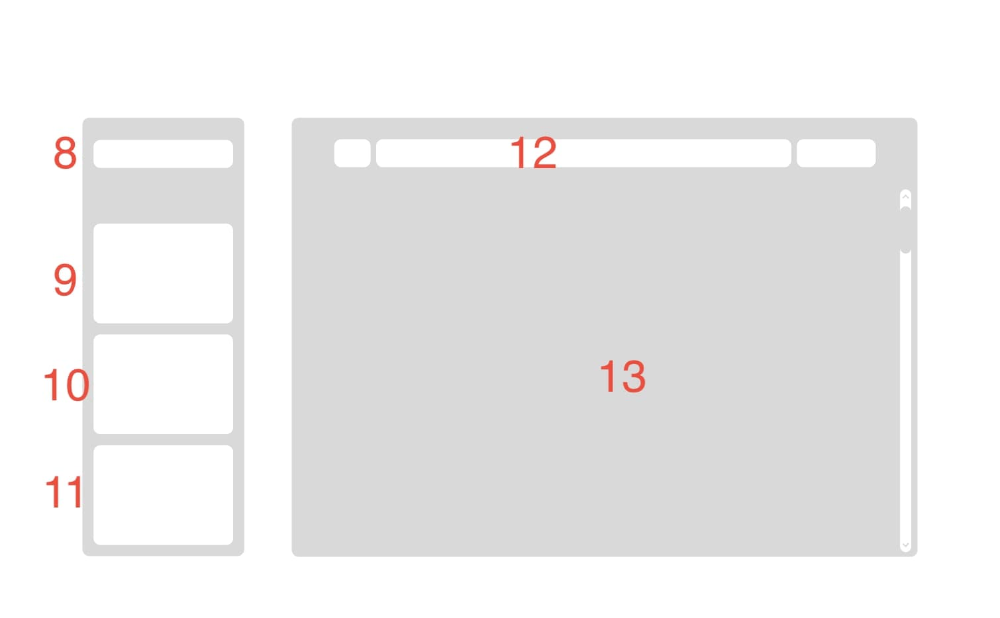

  Fonte: Material produzido pelos autores (2025).

8. **Filtro de Instituição de Ensino (School)**
   Área para selecionar a instituição de ensino desejada(Só aparece para Gerente Geral). Pode influenciar as listas e relatórios exibidos na tela.

9. **Botão "Listar Alunos"**
   Ao clicar, exibe a lista de alunos vinculados à instituição de ensino selecionada ou pré-atribuida ào gerente de unidade.

10. **Botão "Listar Profissionais"**
    Ao clicar, exibe a lista de profissionais (médicos, cuidadores, etc.) que realizaram atividades na instituição.

11. **Botão "Gerenciar Gerentes"**
    Visível apenas para usuários com permissão de gerente geral. Permite visualizar e gerenciar outros gerentes.

12. **Barra de Filtros**
    Localizada na parte superior da coluna central. Permite filtrar ou refinar a lista que está sendo exibida (alunos, profissionais, gerentes, etc.).

13. **Lista de objetos**
    Espaço dedicado para listar Alunos, Profissionais ou gerentes, dependendo de qual botão foi clicado préviamente.

---

#### Lista informações

  Figura X - Wireframe da lista preenchida  

  

  Fonte: Material produzido pelos autores (2025).

14. **Barra de Scroll**
    Ilustra que a lista é "scrollavel".

15. **Área de Listagem / Conteúdo**
    Exibe o resultado selecionado na primeira coluna (alunos, profissionais ou gerentes). Contem informações detalhadas, e quando clicada, leva para a tela de detalhes e gerenciamento.

---

#### Dashboard de Alunos

  Figura X - Wireframe do dashboard dos alunos  

  

  Fonte: Material produzido pelos autores (2025).

- Observação: Analytics só aparecem na listagem de *Alunos*

16. **Gráficos de Barras (Analytics)**
    Mostra dados analíticos referentes aos alunos/profissionais selecionados, possibilitando uma visualização rápida de métricas (por exemplo, atendimentos realizados, condição por escola etc).

17. **Gráficos de Pizza (Analytics)**
    Apresenta dados complementares aos gráficos de barras, permitindo comparar proporções de forma visual, de acordo com o contexto escolhido no dashboard.

---

#### Página do Aluno

  Figura X - Wireframe da Pagina de Aluno  

  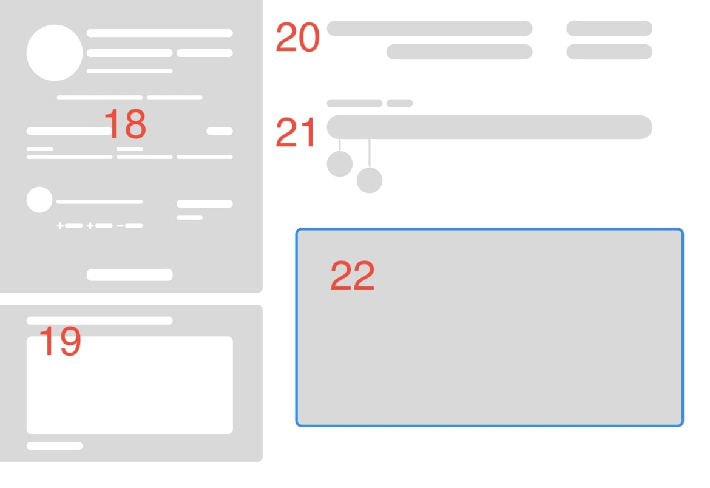

  Fonte: Material produzido pelos autores (2025).

18. **Informações basicas do Aluno**
    Apresenta dados basicos, como nome, email, tecnologias assistivas etc.
19. **Observação**
    Observações gerais daquele aluno, cabe ao Gerente escreve-las.
20. **Informações de Curso**
    Dados como, cursos cursados, data de inicio e fim, turno etc.
21. **Timeline do Aluno**
    Atendimentos e atualizações sobre o aluno aparecerão aqui..
22. **Detalhamento da Timeline**
    Quando clicado em algum elemento da timeline, essa seção irá atualizar com informações complementares.

---

#### Página do Gerente

  Figura X - Wireframe da Pagina de Gerente  

  

  Fonte: Material produzido pelos autores (2025).

23. **Informações do Gerente**
    Nome, Telefone, email, etc. Tambem incluí um botão para editar informações relacionadas.

24. **Unidade de Atuação**
    Incluí onde aquele Gerente está trabalhando e informação de quantos profissionais estão atuando naquela unidade.

25. **Campo de Observações**
    Serve para adicionar qualquer detalhamento necessário sobre aquele Gerente.
    
## 7.2 Desenvolvimento de Mockups
_conteúdo_

## 7.3 Guia Visual
_conteúdo_

# 8. Desenvolvimento do Projeto
_conteúdo_

## 8.1 Arquitetura de Codificação e Estrutura de Diretórios
_conteúdo_

## 8.2 Desenvolvimento de Features
_conteúdo_

**Nota:** Insira uma explicação de entregas em cada Sprint.

## 8.2.1 Sprint 3
_conteúdo_

## 8.2.2 Sprint 4
_conteúdo_

## 8.2.3 Sprint 5
_conteúdo_

## 8.3 Testes Unitários e de Integração
_conteúdo_

## 8.4 Documentações automáticas
_conteúdo_

# 9. Planejamento e Execução de Testes
_conteúdo_

## 9.1 Testes Funcionais
_conteúdo_

## 9.1.1 Planejamento
_conteúdo_

## 9.1.2 Resultados
_conteúdo_

## 9.2 Testes de RNFs
_conteúdo_

## 9.2.1 Planejamento
_conteúdo_

## 9.2.2 Resultados
_conteúdo_

## 9.3 Testes de Usabilidade
_conteúdo_

## 9.3.1 Planejamento
_conteúdo_

## 9.3.2 Resultados
_conteúdo_

# 10. Procedimentos de Implantação
_conteúdo_

## 10.1 Implantação e Configuração do Banco de Dados
_conteúdo_

## 10.2 Implantação do Protótipo para uso por equipe de desenvolvimento
_conteúdo_

# Referências
_conteúdo_
