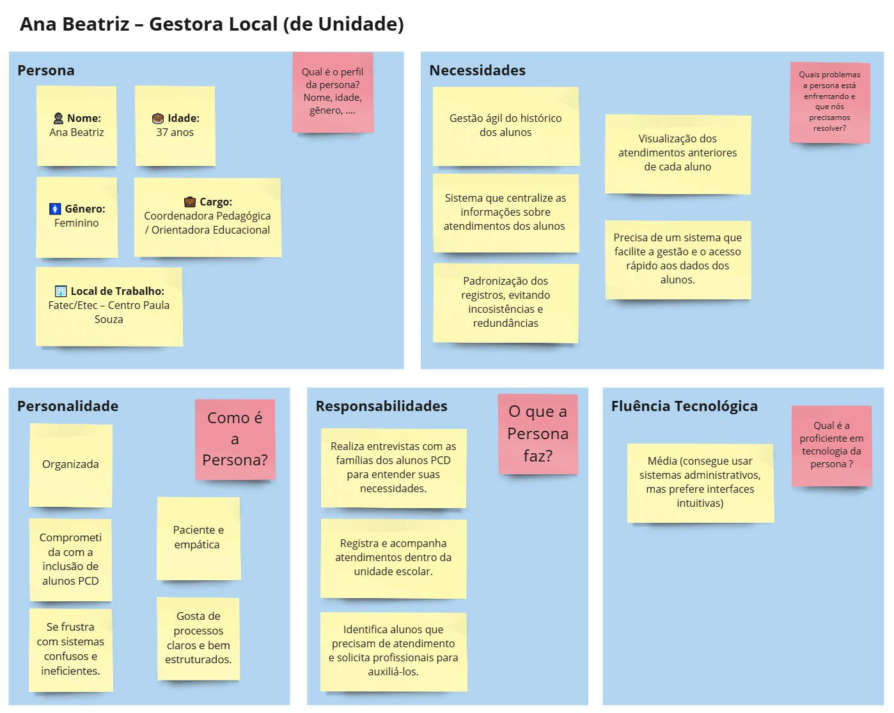
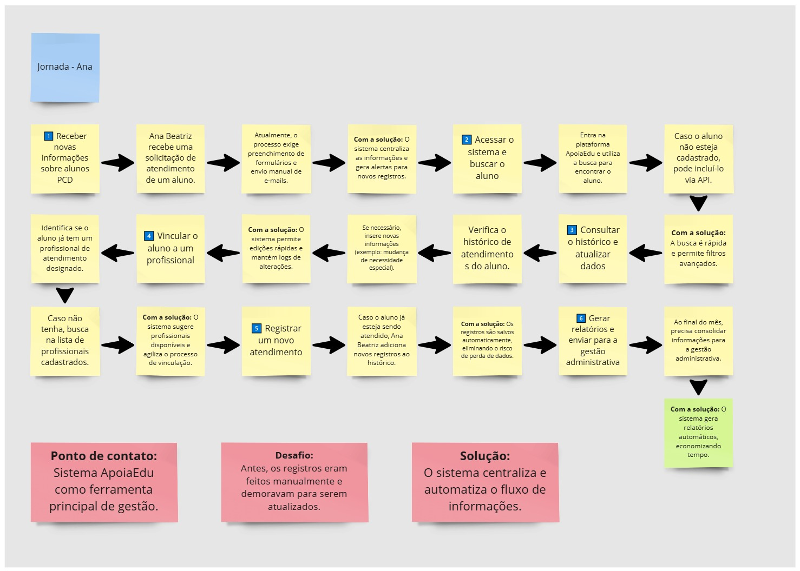
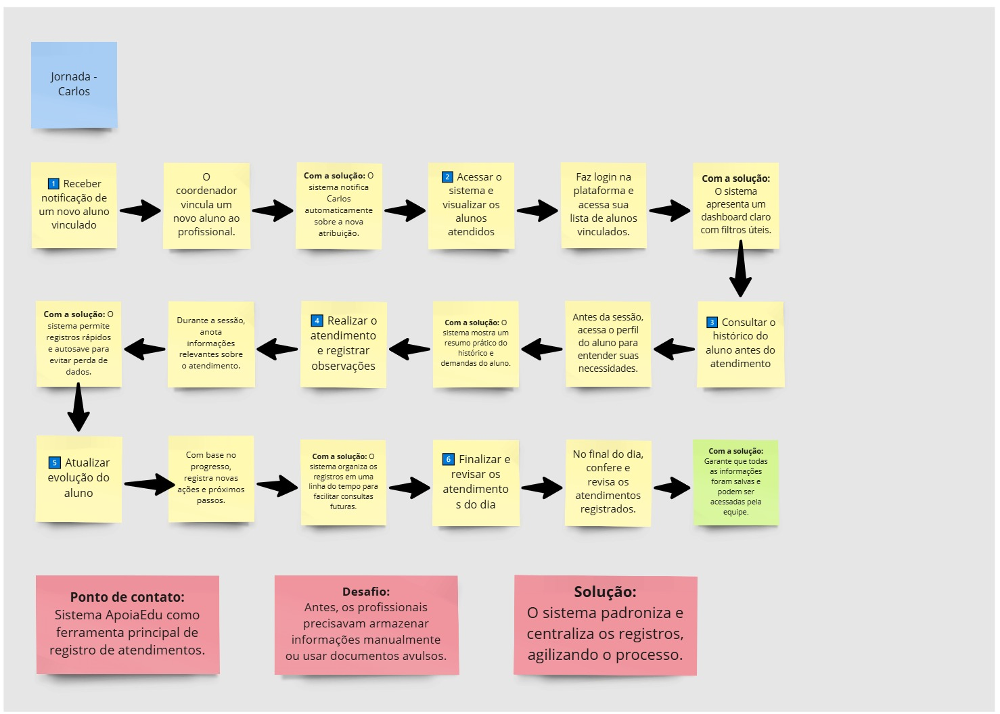

  

 

# Nome do Projeto: <TODO>

## Nome do Grupo: <TODO>

## Integrantes:

- <a href="https://www.linkedin.com/in/anna-riciopo/">Anna Giulia Marques Riciopo</a>
- <a href="https://www.linkedin.com/in/danielaraujogonncalves/">Daniel Augusto de Araujo Gonçalves</a>
- <a href="https://www.linkedin.com/in/joao-souza-campos/">João Victor de Souza Campos</a>
- <a href="https://www.linkedin.com/in/lucas-brasil9/">Lucas Paiva Brasil</a>
- <a href="https://www.linkedin.com/in/natalycunha/">Nataly de Souza Cunha</a>
- <a href="https://www.linkedin.com/in/otavio-vasc/">Otávio de Carvalho Vasconcelos</a>
- <a href="https://www.linkedin.com/in/thiagogomesalmeida/">Thiago Gomes de Almeida</a>

# Sumário

- [1. Introdução](#1-introdução)
  - [1.1 Termos e Abreviações](#11-termos-e-abreviações)
  - [1.2 Objetivo do Documento](#12-objetivo-do-documento)
- [2. Entendimento do Projeto e do Negócio](#2-entendimento-do-projeto-e-do-negócio)
  - [2.1 Contexto da Indústria do Parceiro](#21-contexto-da-indústria-do-parceiro)
  - [2.2 Problema](#22-problema)
  - [2.3 Visão do Projeto e do Produto](#23-visão-do-projeto-e-do-produto)
  - [2.4 Personas e Jornada do Usuário](#24-personas-e-jornada-do-usuário)
  - [2.5 Modelagem do Fluxo de Negócio](#25-modelagem-do-fluxo-de-negócio)
    - [2.5.1 Fluxo de Negócio Atual (AS-IS)](#251-fluxo-de-negócio-atual-as-is)
    - [2.5.2 Fluxo de Negócio Proposto (TO-BE)](#252-fluxo-de-negócio-proposto-to-be)
  - [2.6 Matriz de Risco do Projeto](#26-matriz-de-risco-do-projeto)
  - [2.7 Ideação](#27-ideação)
    - [2.7.1 Brainstorming de features](#271-brainstorming-de-features)
    - [2.7.2 Sequenciamento/Priorização de entregas](#272-sequenciamentopriorização-de-entregas)
  - [2.8 Canvas do Projeto](#28-canvas-do-projeto)
- [3. Requisitos do Projeto](#3-requisitos-do-projeto)
  - [3.1 Requisitos Funcionais (RFs)](#31-requisitos-funcionais-rfs)
  - [3.2 Requisitos Não Funcionais (RNFs)](#32-requisitos-não-funcionais-rnfs)
  - [3.3 Correlação RFs e RNFs](#33-correlação-rfs-e-rnfs)
- [4. Modelagem de Dados](#4-modelagem-de-dados)
  - [4.1 Modelo Conceitual de Dados](#41-modelo-conceitual-de-dados)
  - [4.2 Modelo Lógico de Dados](#42-modelo-lógico-de-dados)
  - [4.3 Modelo Físico de Dados](#43-modelo-físico-de-dados)
- [5. Solução Técnica (Design)](#5-solução-técnica-design)
  - [5.1 Diagrama de Componentes da UML](#51-diagrama-de-componentes-da-uml)
  - [5.2 Diagramas de Sequência da UML](#52-diagramas-de-sequência-da-uml)
  - [5.3 Descrição Textual dos Diagramas](#53-descrição-textual-dos-diagramas)
- [6. Mapeamento Técnico de Infraestrutura e Implantação](#6-mapeamento-técnico-de-infraestrutura-e-implantação)
  - [6.1 Diagrama de Implantação da UML](#61-diagrama-de-implantação-da-uml)
  - [6.2 Justificativa das Escolhas de Implantação](#62-justificativa-das-escolhas-de-implantação)
  - [6.3 Considerações sobre Desempenho e Segurança](#63-considerações-sobre-desempenho-e-segurança)
- [7. Projeto Visual da Solução](#7-projeto-visual-da-solução)
  - [7.1 Desenvolvimento de Wireframes](#71-desenvolvimento-de-wireframes)
  - [7.2 Desenvolvimento de Mockups](#72-desenvolvimento-de-mockups)
  - [7.3 Guia Visual](#73-guia-visual)
- [8. Desenvolvimento do Projeto](#8-desenvolvimento-do-projeto)
  - [8.1 Arquitetura de Codificação e Estrutura de Diretórios](#81-arquitetura-de-codificação-e-estrutura-de-diretórios)
  - [8.2 Desenvolvimento de Features](#82-desenvolvimento-de-features)
    - [8.2.1 Sprint 3](#821-sprint-3)
    - [8.2.2 Sprint 4](#822-sprint-4)
    - [8.2.3 Sprint 5](#823-sprint-5)
  - [8.3 Testes Unitários e de Integração](#83-testes-unitários-e-de-integração)
  - [8.4 Documentações automáticas](#84-documentações-automáticas)
- [9. Planejamento e Execução de Testes](#9-planejamento-e-execução-de-testes)
  - [9.1 Testes Funcionais](#91-testes-funcionais)
    - [9.1.1 Planejamento](#911-planejamento)
    - [9.1.2 Resultados](#912-resultados)
  - [9.2 Testes de RNFs](#92-testes-de-rnfs)
    - [9.2.1 Planejamento](#921-planejamento)
    - [9.2.2 Resultados](#922-resultados)
  - [9.3 Testes de Usabilidade](#93-testes-de-usabilidade)
    - [9.3.1 Planejamento](#931-planejamento)
    - [9.3.2 Resultados](#932-resultados)
- [10. Procedimentos de Implantação](#10-procedimentos-de-implantação)
  - [10.1 Implantação e Configuração do Banco de Dados](#101-implantação-e-configuração-do-banco-de-dados)
  - [10.2 Implantação do Protótipo para uso por equipe de desenvolvimento](#102-implantação-do-protótipo-para-uso-por-equipe-de-desenvolvimento)
- [Referências](#referências)

# 1. Introdução
_conteúdo_

## 1.1 Termos e Abreviações
_conteúdo_

## 1.2 Objetivo do Documento
_conteúdo_

# 2. Entendimento do Projeto e do Negócio

&emsp;Esta seção busca detalhar o contexto de negócios do Centro Paula Sousa (CPS), bem como o problema apresentado pela empresa parceira que embasou o desenvolvimento deste projeto.

## 2.1 Contexto da Indústria do Parceiro
&emsp;O Centro Paula Sousa é uma autarquia sediada e voltada para o estado de São Paulo, oferecendo ensino profissional para cerca de 317 mil discentes em 345 municípios, dentro de escolas técnicas, faculdades de tecnologia e salas de aulas descentralizadas. Muitas das atividades exercidas no CPS se relacionam com a administração pública do Governo do Estado, devido à sua vinculação com a Secretaria de Ciência, Tecnologia e Inovação, buscando oferecer serviços educacionais com qualidade, governança e inclusão social (CPS, c2025). 

&emsp;Observando-se o organograma do Centro, cada escola/faculdade representa uma unidade, gerida por um gestor ou coordenador. As operações de todas as unidades, no entanto, são monitoradas pelo cargo de Gestão Administrativa, que detém a visão analítica e estratégica das atividades educacionais, seus alunos e profissionais. Considerável parte dos alunos do CPS são pessoas com deficiência, apontando necessidade de atendimentos específicos. Com isso, cabe ao time de Acessoria de Inclusão — também composto por um servidor com deficiência visual — a oficializar essas solicitações através de uma Ficha de Acompanhamento do Atendimento Educacional Especializado (FAE); preparada essa ficha, um profissional externo é contratado para prestar o atendimento para o respectivo aluno (CPS, c2025). 

&emsp;Nesse contexto, vale ressaltar que, segundo a Lei Brasileira de Inclusão da Pessoa com Deficiência - Lei 13.146/2015, o acesso à educação, ao trabalho, à mobilidade e tecnologias assistivas deve ser garantido para essa população na sociedade. Felizmente, em ambiente escolares e profissionais, são cada vez mais disseminadas e evoluídas tanto tecnologias assistivas — como leitores de tela, tradutores de libras, recursos digitais — quanto atendimentos especializados, o que demonstra a crescente oferta e aprimoramento de soluções tecnológicas que auxiliem pessoas com deficiência em suas atividades cotidianas.

## 2.2 Problema

&emsp;Em relação à administração das informações pessoais dos alunos com deficiência do Centro Paula Sousa e dos atendimentos especializados, apesar da utilização de sistemas digitais para armazenar os dados dessas frentes, não se tem a centralização dos detalhes dos atendimentos em um único lugar, cabendo à Gestão de Administração realizar manualmente o levantamento e cruzamento dessas informações, através de formulários e planilhas digitais. Dessa forma, o presente projeto pretende erradicar esse problema de descentralização de dados, de forma a garantir eficiência e diminuição de erros manuais para o trabalho da administração central do CPS, integrando também recursos de acessibilidade, garantindo a inclusão dos profissionais da Acessoria de Inclusão, como apontado na lei Lei 13.146/2015.

## 2.3 Visão do Projeto e do Produto
  _conteúdo_

  **Nota**: _Insira aqui informações sobre o que se trata o projeto e que valor ele vai entregar, Objetivos do Produto e O que o produto faz e não faz._

## 2.4 Personas e Jornada do Usuário
&emsp;Para garantir que a plataforma ApoiaEdu atenda de forma eficiente às necessidades de seus usuários, é fundamental entender quem são essas pessoas, quais desafios enfrentam e como interagem com o sistema.

&emsp;A criação de personas e o mapeamento da jornada do usuário são práticas essenciais no desenvolvimento de produtos, pois ajudam a visualizar como diferentes perfis utilizam a solução no dia a dia.

### Por que criamos personas?
&emsp;As personas representam perfis fictícios baseados em usuários reais do sistema, descrevendo suas funções, desafios e expectativas. Elas nos ajudam a tomar decisões mais precisas no desenvolvimento da plataforma, garantindo que o sistema seja útil e acessível para aqueles que realmente precisam dele.

### Por que mapear a jornada do usuário?
&emsp;A jornada do usuário descreve o caminho que cada persona percorre ao interagir com o sistema. Isso permite identificar pontos de dor, oportunidades de melhoria e necessidades específicas, garantindo que o ApoiaEdu resolva problemas reais de forma eficiente.

### O que você encontrará a seguir?
&emsp;A seguir, apresentamos as principais personas que utilizarão o ApoiaEdu e suas respectivas jornadas de uso, detalhando passo a passo suas interações com a plataforma. Com isso, buscamos tornar a experiência mais fluida, eficiente e acessível para todos os envolvidos no processo de inclusão educacional.

### Persona 1 - Ana Beatriz

  Figura X - Persona Ana Beatriz  

  

  Fonte: Material produzido pelos autores (2025).

#### **Persona: Ana Beatriz – Gestora Local (de Unidade)**

👤 **Nome:** Ana Beatriz

🎂 **Idade:** 37 anos

💼 **Cargo:** Coordenadora Pedagógica / Orientadora Educacional

🏢 **Local de Trabalho:** Fatec/Etec – Centro Paula Souza

💻 **Proficiência em Tecnologia:** Média (consegue usar sistemas administrativos, mas prefere interfaces intuitivas)

#### **Necessidades**

Histórico dos alunos unificado, evitando a dificuldade na busca de informações.

Obter um retorno rápido sobre os dados enviados, evitando informações desatualizadas.

Padronização nos registros, evitando inconsistências.

Identificar quais alunos precisam de profissionais.

#### **Como é a Ana Beatriz?**

Organizada e comprometida com a inclusão dos alunos PCD.

Paciente e empática, pois lida diretamente com alunos e suas famílias.

Gosta de processos claros e bem estruturados, mas **não tem tempo para sistemas burocráticos**.

Se frustra com a **falta de retorno rápido sobre os dados enviados**.

#### **O que Ana Beatriz faz?**

Realiza entrevistas com as famílias dos alunos PCD para entender suas necessidades.

Registra e acompanha atendimentos dentro da unidade escolar.

Identifica alunos que precisam de atendimento e solicita profissionais para auxiliá-los.

Atualiza informações sobre atendimentos e necessidades dos alunos na plataforma.

### Jornada de Usuário da Ana Beatriz (Gestora Local de Unidade)

  Figura X - Jornada de Usuário da Ana Beatriz  

  

  Fonte: Material produzido pelos autores (2025).

**Objetivo:** Garantir que os dados dos alunos estejam atualizados, vinculando profissionais e organizando atendimentos.

#### Jornada Passo a Passo

1️⃣ **Receber novas informações sobre alunos PCD**

Ana Beatriz recebe uma solicitação de atendimento de um aluno.

Atualmente, o processo exige preenchimento de formulários e envio manual de e-mails.

**Com a solução:** O sistema centraliza as informações e gera alertas para novos registros.

2️⃣ **Acessar o sistema e buscar o aluno**

Entra na plataforma ApoiaEdu e utiliza a busca para encontrar o aluno.

Caso o aluno não esteja cadastrado, pode incluí-lo via API.

**Com a solução:** A busca é rápida e permite filtros avançados.

3️⃣ **Consultar o histórico e atualizar dados**

Verifica o histórico de atendimentos do aluno.

Se necessário, insere novas informações (exemplo: mudança de necessidade especial).

**Com a solução:** O sistema permite edições rápidas e mantém logs de alterações.

4️⃣ **Vincular o aluno a um profissional**

Identifica se o aluno já tem um profissional de atendimento designado.

Caso não tenha, busca na lista de profissionais cadastrados.

**Com a solução:** O sistema sugere profissionais disponíveis e agiliza o processo de vinculação.

5️⃣ **Registrar um novo atendimento**

Caso o aluno já esteja sendo atendido, Ana Beatriz adiciona novos registros ao histórico.

**Com a solução:** Os registros são salvos automaticamente, eliminando o risco de perda de dados.

6️⃣ **Gerar relatórios e enviar para a gestão administrativa**

Ao final do mês, precisa consolidar informações para a gestão administrativa.

**Com a solução:** O sistema gera relatórios automáticos, economizando tempo.

### **Pontos de Contato e Desafios**

**Ponto de contato:** Sistema ApoiaEdu como ferramenta principal de gestão.

**Desafio:** Antes, os registros eram feitos manualmente e demoravam para serem atualizados.

**Solução:** O sistema centraliza e automatiza o fluxo de informações.
  

### Persona 2 - Carlos Mendes – Profissional de Atendimento

  Figura X - Persona Carlos Mendes  

  

  Fonte: Material produzido pelos autores (2025).

👤 **Nome:** Carlos Mendes

🎂 **Idade:** 42 anos

💼 **Cargo:** Psicólogo da Assessoria de Inclusão

🏢 **Local de Trabalho:** Fatec/Etec – Centro Paula Souza

💻 **Proficiência em Tecnologia:** Baixa a Média (usa apenas o necessário para registrar atendimentos)

#### **Necessidades**

Um sistema contendo o histórico do aluno, evitando retrabalho durante a consulta com o mesmo.

Histórico com os atendimentos do aluno, evitando a dificuldade de dar continuidade nos acompanhamentos.

Um sistema para registrar informações com facilidade, pois os processos atuais são manuais.

#### **Como é o Carlos Mendes?**

Atencioso e empático, pois lida diretamente com alunos com deficiência.

Prático e objetivo, prefere **sistemas simples e rápidos** de usar.

Se frustra com **processos burocráticos e sistemas complexos**.

#### **O que Carlos Mendes faz?**

Realiza atendimentos psicológicos e pedagógicos para alunos com deficiência.

Consulta o histórico do aluno para entender o progresso e planejar atendimentos.

Registra relatórios e observações sobre cada sessão.

### Jornada de Usuário do Carlos Mendes (Profissional de Atendimento)

  Figura X - Jornada de Usuário do Carlos Mendes   

  

  Fonte: Material produzido pelos autores (2025).

**Objetivo:** Realizar atendimentos eficientes, registrando informações de forma rápida e acessível.

#### Jornada Passo a Passo

1️⃣ **Receber notificação de um novo aluno vinculado**

O coordenador vincula um novo aluno ao profissional.

**Com a solução:** O sistema notifica Carlos automaticamente sobre a nova atribuição.

2️⃣ **Acessar o sistema e visualizar os alunos atendidos**

Faz login na plataforma e acessa sua lista de alunos vinculados.

**Com a solução:** O sistema apresenta um dashboard claro com filtros úteis.

3️⃣ **Consultar o histórico do aluno antes do atendimento**

Antes da sessão, acessa o perfil do aluno para entender suas necessidades.

**Com a solução:** O sistema mostra um resumo prático do histórico e demandas do aluno.

4️⃣ **Realizar o atendimento e registrar observações**

Durante a sessão, anota informações relevantes sobre o atendimento.

**Com a solução:** O sistema permite registros rápidos e autosave para evitar perda de dados.

5️⃣ **Atualizar evolução do aluno**

Com base no progresso, registra novas ações e próximos passos.

**Com a solução:** O sistema organiza os registros em uma linha do tempo para facilitar consultas futuras.

6️⃣ **Finalizar e revisar os atendimentos do dia**

No final do dia, confere e revisa os atendimentos registrados.

**Com a solução:** Garante que todas as informações foram salvas e podem ser acessadas pela equipe.

### **Pontos de Contato e Desafios**

**Ponto de contato:** Sistema ApoiaEdu como ferramenta principal de registro de atendimentos.

**Desafio:** Antes, os profissionais precisavam armazenar informações manualmente ou usar documentos avulsos.

**Solução:** O sistema padroniza e centraliza os registros, agilizando o processo.
  

### Persona 3 - Fernanda Rocha – Gestora Administrativa

  Figura X - Persona Fernanda Rocha  

  

  Fonte: Material produzido pelos autores (2025).

👤 **Nome:** Fernanda Rocha

🎂 **Idade:** 48 anos

💼 **Cargo:** Coordenadora da Assessoria de Inclusão

🏢 **Local de Trabalho:** Fatec/Etec – Centro Paula Souza

💻 **Proficiência em Tecnologia:** Média (usa sistemas administrativos, mas não tem conhecimento técnico avançado)

#### **Necessidades**

Um sistema para consolidar informações sobre os atendimentos prestados.

Dados padronizados, evitando a dificuldade em analisar inclusões nas unidades.

Um sistema contendo geração de relatórios.

#### **Como é a Fernanda Rocha?**

Estratégica e analítica, precisa de **métricas para tomar decisões**.

Valoriza a **organização e eficiência** no trabalho.

Se frustra com a falta de dados estruturados e tempo perdido com burocracia.

#### **O que Fernanda Rocha faz?**

Supervisiona a equipe da Assessoria de Inclusão.

Gera relatórios e métricas sobre os atendimentos prestados.

Define estratégias para melhorar a inclusão nas Fatecs e Etecs.

Precisa de um sistema que organize os dados e facilite a geração de relatórios estratégicos.

### Jornada de Usuário da Fernanda Rocha (Gestora Administrativa)

  Figura X - Jornada de Usuário do Carlos Mendes   

  

  Fonte: Material produzido pelos autores (2025).

**Objetivo:** Realizar atendimentos eficientes, registrando informações de forma rápida e acessível.

#### Jornada Passo a Passo

1️⃣ **Acessar o sistema para visualizar métricas gerais**

Entra na plataforma e visualiza os principais indicadores de atendimento.

**Com a solução:** O sistema exibe um dashboard intuitivo com gráficos e KPIs.

2️⃣ **Filtrar relatórios por unidade, aluno ou profissional**

Busca informações específicas, como número de alunos atendidos por unidade.

**Com a solução:** Usa filtros personalizados para gerar relatórios detalhados.

3️⃣ **Identificar alunos sem profissionais vinculados**

Analisa se há alunos sem atendimento e direciona ações para resolver o problema.

**Com a solução:** O sistema destaca alunos sem atendimento ativo.

4️⃣ **Gerar relatórios estratégicos para planejamento**

Precisa criar documentos para apresentar à diretoria e parceiros.

**Com a solução:** O sistema permite exportação automática de relatórios.

5️⃣ **Realizar ajustes na plataforma conforme necessidade**

Pode modificar parâmetros administrativos ou sugerir mudanças nas diretrizes de atendimento.

**Com a solução:** Tem permissões avançadas para gerenciar configurações da plataforma.

#### **Pontos de Contato e Desafios**

**Ponto de contato:** Sistema ApoiaEdu como ferramenta principal de análise e planejamento.

**Desafio:** Antes, os relatórios eram gerados manualmente e demandavam muito tempo.

**Solução:** O sistema automatiza a extração e análise de dados.
  

## 2.5 Modelagem do Fluxo de Negócio
_conteúdo_

## 2.5.1 Fluxo de Negócio Atual (AS-IS)
_conteúdo_

## 2.5.2 Fluxo de Negócio Proposto (TO-BE)
_conteúdo_

## 2.6 Matriz de Risco do Projeto
_conteúdo_

## 2.7 Ideação
_conteúdo_

## 2.7.1 Brainstorming de features
_conteúdo_

## 2.7.2 Sequenciamento/Priorização de entregas
_conteúdo_

## 2.8 Canvas do Projeto
_conteúdo_

# 3. Requisitos do Projeto

Para garantir que o sistema **ApoiaEdu** atenda às necessidades dos usuários e funcione de maneira eficiente, é importante definir claramente seus requisitos.

Os **Requisitos Funcionais (RFs)** descrevem o que o sistema deve fazer, ou seja, suas principais funcionalidades, como o cadastro de usuários, a gestão de atendimentos e a exibição de informações relevantes. Cada um desses requisitos está associado a testes que garantem sua correta implementação e funcionamento.

Além dos RFs, temos os **Requisitos Não Funcionais (RNFs)**, que especificam como o sistema deve se comportar. Eles abordam aspectos como segurança, desempenho, usabilidade e conformidade com normas, garantindo que o sistema seja robusto, acessível e confiável.

Por fim, há uma correlação entre RFs e RNFs, pois um requisito funcional pode depender de um requisito não funcional para ser eficaz. Por exemplo, um sistema pode permitir o cadastro de usuários (RF), mas precisa seguir regras de segurança e privacidade (RNF) para proteger os dados.

A seguir, detalharemos todos esses requisitos, assegurando que o ApoiaEdu seja desenvolvido com qualidade, segurança e alinhado às expectativas dos usuários.

## 3.1 Requisitos Funcionais (RFs)

| ID   | Descrição                                                                                                | Justificativa |
| ---- | -------------------------------------------------------------------------------------------------------- | ------------- |
| RF01 | O sistema deve permitir o cadastro de Gerente Geral e Gerente de Unidade.                                | Base do sistema, possibilitando o uso do sistema apenas à usuários permitidos |
| RF02 | O sistema deve permitir o cadastro de Unidade de Ensino.                                                 | Base do sistema, permitindo os alunos tenham vinculo à uma Unidade de Ensino. |
| RF03 | O sistema deve permitir o cadastro de alunos via API, garantindo a validação de dados.                   | Base do sistema, permitindo a coordenação desses dados. |
| RF04 | O sistema deve apresentar um dashboard com informações dos alunos, incluindo filtros e buscas avançadas. | Visualização e organização dos dados, facilitando a gestão dos mesmos |
| RF05 | O sistema deve permitir a gestão de profissionais, incluindo cadastro, edição e exclusão de dados.       | Facilitar e centralizar o registro de profissionais que atendem alunos de Etecs e Fatecs |
| RF06 | O sistema deve permitir a gestão de atendimentos, garantindo a inclusão, edição e exclusão de registros. | Facilitar o controle e histórico de atendimentos daquele aluno |
| RF07 | O sistema deve registrar logs das ações dos usuários para fins de controle da gestão.               | Base do projeto, controle dos eventos e mudanças relacionadas ao aluno durante sua formação. |
| RF08 | O sistema deve permitir a visualização do histórico completo do aluno.                                   | Complementam a gestão de atendimentos com informações detalhadas e status. |
| RF09 | O sistema deve permitir a listagem e consulta de tecnologias assistivas disponíveis para os alunos.      | Complementam a gestão de atendimentos com informações detalhadas e status. |
| RF10 | O sistema deve permitir a atualização do status de atendimento dos alunos.                               | Complementam a gestão de atendimentos com informações detalhadas e status. |
| RF11 | O sistema deve exibir uma timeline do aluno com todos os registros de atendimentos e evoluções.          | Agregam valor ao produto, melhorando a experiência do usuário e a comunicação. |
| RF12 | O sistema deve enviar notificações aos usuários sobre eventos relevantes, como novos atendimentos.       | Agregam valor ao produto, melhorando a experiência do usuário e a comunicação. |

### Testes de Validação dos Requisitos Funcionais

| ID   | Teste | Pré-condição | Procedimento | Resultado Esperado | Pós-condição |
| ---- | ----- | ----------- | ------------ | ------------------ | ------------ |
| RF01 | Criar Gerente | O usuário deve ter permissões de administrador. | Acessar a tela de cadastro, preencher os dados obrigatórios e confirmar. | O gerente é cadastrado e aparece na listagem. | O novo gerente pode acessar o sistema conforme suas permissões. |
| RF02 | Criar Unidade de Ensino | O usuário deve estar autenticado e ter permissões adequadas. | Acessar a tela de cadastro, inserir os dados necessários e confirmar. | A unidade é cadastrada e aparece na listagem. | A unidade pode ser associada a alunos. |
| RF03 | Cadastro de Aluno via API | O serviço de API deve estar disponível. | Enviar uma requisição POST com dados válidos. | O aluno é cadastrado e pode ser recuperado via API. | O aluno fica disponível para consulta e edição. |
| RF04 | Consulta no Dashboard | O banco de dados deve conter registros de alunos. | Acessar o dashboard e aplicar filtros de pesquisa. | O sistema retorna os dados corretos conforme os filtros aplicados. | O usuário pode visualizar e interagir com os dados retornados. |
| RF05 | Gestão de Profissionais | O usuário deve ter permissões para gerenciar profissionais. | Acessar a tela de gestão, cadastrar um profissional e salvar. | O profissional é cadastrado e listado no sistema. | O profissional pode ser editado ou excluído posteriormente. |
| RF06 | Gestão de Atendimentos | O aluno e o profissional devem estar cadastrados no sistema. | Criar um novo atendimento, preencher os dados e salvar. | O atendimento fica registrado e pode ser acessado posteriormente. | O atendimento pode ser editado ou excluído. |
| RF07 | Registro de Logs | O sistema deve estar operando normalmente. | Executar ações como cadastro, edição ou exclusão de registros. | O sistema armazena os logs corretamente com data, usuário e ação realizada. | Os logs podem ser consultados por usuários autorizados. |
| RF08 | Histórico do Aluno | O aluno deve possuir atendimentos registrados. | Acessar o perfil do aluno e visualizar o histórico. | O histórico exibe todas as interações e atendimentos registrados. | O usuário pode utilizar as informações do histórico para futuras ações. |
| RF09 | Consulta de Tecnologias Assistivas | O sistema deve ter tecnologias cadastradas. | Acessar a listagem e realizar buscas por tecnologia. | O sistema exibe as tecnologias disponíveis corretamente. | As tecnologias podem ser associadas a alunos conforme necessário. |
| RF10 | Atualização de Status de Atendimento | O aluno deve ter um atendimento registrado. | Editar um atendimento e alterar seu status. | O novo status é salvo e reflete no atendimento do aluno. | O status atualizado pode ser consultado no histórico do aluno. |
| RF11 | Exibição da Timeline | O aluno deve possuir registros de atendimento. | Acessar o perfil do aluno e visualizar a timeline. | A timeline exibe os registros de forma cronológica. | O usuário pode utilizar os dados para análise e acompanhamento. |
| RF12 | Envio de Notificações | O usuário deve estar cadastrado e com notificações ativadas. | Criar um novo atendimento ou evento relevante. | O sistema dispara uma notificação para os usuários envolvidos. | Os usuários são informados e podem tomar ações necessárias. |

## 3.2 Requisitos Não Funcionais (RNFs)
_conteúdo_

## 3.3 Correlação RFs e RNFs
_conteúdo_

# 4. Modelagem de Dados
_conteúdo_

## 4.1 Modelo Conceitual de Dados
_conteúdo_

## 4.2 Modelo Lógico de Dados
_conteúdo_

## 4.3 Modelo Físico de Dados
_conteúdo_

**Nota:** Insira uma explicação e direcionamento para o readme.md da pasta database.

# 5. Solução Técnica (Design)
_conteúdo_

## 5.1 Diagrama de Componentes da UML
_conteúdo_

## 5.2 Diagramas de Sequência da UML
_conteúdo_

## 5.3 Descrição Textual dos Diagramas
_conteúdo_

# 6. Mapeamento Técnico de Infraestrutura e Implantação
_conteúdo_

## 6.1 Diagrama de Implantação da UML
_conteúdo_

## 6.2 Justificativa das Escolhas de Implantação
_conteúdo_

## 6.3 Considerações sobre Desempenho e Segurança
_conteúdo_

# 7. Projeto Visual da Solução
_conteúdo_

## 7.1 Desenvolvimento de Wireframes
_conteúdo_

## 7.2 Desenvolvimento de Mockups
_conteúdo_

## 7.3 Guia Visual
_conteúdo_

# 8. Desenvolvimento do Projeto
_conteúdo_

## 8.1 Arquitetura de Codificação e Estrutura de Diretórios
_conteúdo_

## 8.2 Desenvolvimento de Features
_conteúdo_

**Nota:** Insira uma explicação de entregas em cada Sprint.

## 8.2.1 Sprint 3
_conteúdo_

## 8.2.2 Sprint 4
_conteúdo_

## 8.2.3 Sprint 5
_conteúdo_

## 8.3 Testes Unitários e de Integração
_conteúdo_

## 8.4 Documentações automáticas
_conteúdo_

# 9. Planejamento e Execução de Testes
_conteúdo_

## 9.1 Testes Funcionais
_conteúdo_

## 9.1.1 Planejamento
_conteúdo_

## 9.1.2 Resultados
_conteúdo_

## 9.2 Testes de RNFs
_conteúdo_

## 9.2.1 Planejamento
_conteúdo_

## 9.2.2 Resultados
_conteúdo_

## 9.3 Testes de Usabilidade
_conteúdo_

## 9.3.1 Planejamento
_conteúdo_

## 9.3.2 Resultados
_conteúdo_

# 10. Procedimentos de Implantação
_conteúdo_

## 10.1 Implantação e Configuração do Banco de Dados
_conteúdo_

## 10.2 Implantação do Protótipo para uso por equipe de desenvolvimento
_conteúdo_

# Referências
_conteúdo_
