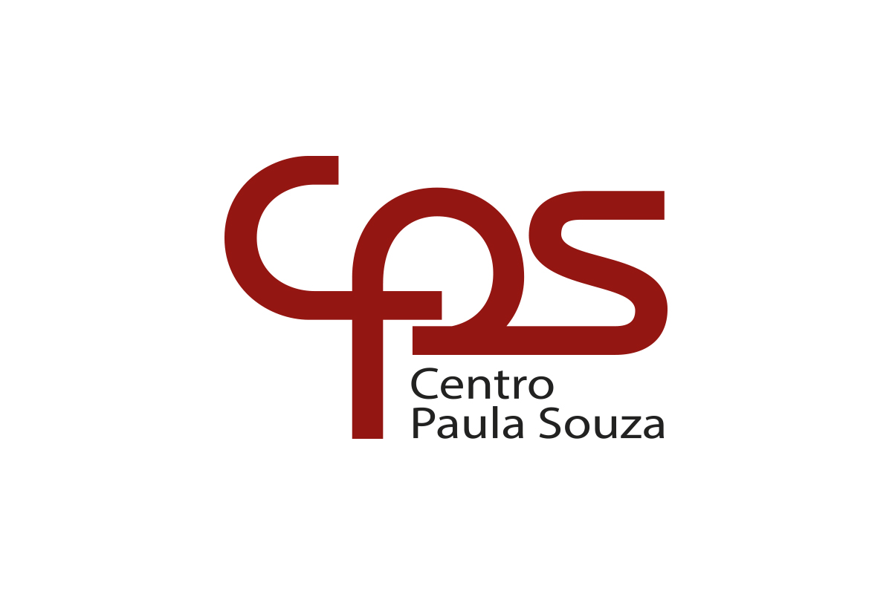

<Table>
  <tr>
    <td><a href= "https://www.cps.sp.gov.br/"></td>
    <td>
      
    </td>
  </tr>
</table>

# Nome do Projeto: <TODO>

## Nome do Grupo: <TODO>

## Integrantes:

- <a href="https://www.linkedin.com/in/anna-riciopo/">Anna Giulia Marques Riciopo</a>  
- <a href="https://www.linkedin.com/in/danielaraujogonncalves/">Daniel Augusto de Araujo Gonçalves</a>  
- <a href="https://www.linkedin.com/in/joao-souza-campos/">João Victor de Souza Campos</a>  
- <a href="https://www.linkedin.com/in/lucas-brasil9/">Lucas Paiva Brasil</a>  
- <a href="https://www.linkedin.com/in/natalycunha/">Nataly de Souza Cunha</a>  
- <a href="https://www.linkedin.com/in/otavio-vasc/">Otávio Vasconcelos</a>  
- <a href="https://www.linkedin.com/in/thiagogomesalmeida/">Thiago Gomes de Almeida</a> 

# Sumário

- [1. Introdução](#1-introdução)
  - [1.1 Termos e Abreviações](#11-termos-e-abreviações)
  - [1.2 Objetivo do Documento](#12-objetivo-do-documento)
- [2. Entendimento do Projeto e do Negócio](#2-entendimento-do-projeto-e-do-negócio)
  - [2.1 Contexto da Indústria do Parceiro](#21-contexto-da-indústria-do-parceiro)
  - [2.2 Problema](#22-problema)
  - [2.3 Visão do Projeto e do Produto](#23-visão-do-projeto-e-do-produto)
  - [2.4 Personas e Jornada do Usuário](#24-personas-e-jornada-do-usuário)
  - [2.5 Modelagem do Fluxo de Negócio](#25-modelagem-do-fluxo-de-negócio)
    - [2.5.1 Fluxo de Negócio Atual (AS-IS)](#251-fluxo-de-negócio-atual-as-is)
    - [2.5.2 Fluxo de Negócio Proposto (TO-BE)](#252-fluxo-de-negócio-proposto-to-be)
  - [2.6 Matriz de Risco do Projeto](#26-matriz-de-risco-do-projeto)
  - [2.7 Ideação](#27-ideação)
    - [2.7.1 Brainstorming de features](#271-brainstorming-de-features)
    - [2.7.2 Sequenciamento/Priorização de entregas](#272-sequenciamentopriorização-de-entregas)
  - [2.8 Canvas do Projeto](#28-canvas-do-projeto)
- [3. Requisitos do Projeto](#3-requisitos-do-projeto)
  - [3.1 Requisitos Funcionais (RFs)](#31-requisitos-funcionais-rfs)
  - [3.2 Requisitos Não Funcionais (RNFs)](#32-requisitos-não-funcionais-rnfs)
  - [3.3 Correlação RFs e RNFs](#33-correlação-rfs-e-rnfs)
- [4. Modelagem de Dados](#4-modelagem-de-dados)
  - [4.1 Modelo Conceitual de Dados](#41-modelo-conceitual-de-dados)
  - [4.2 Modelo Lógico de Dados](#42-modelo-lógico-de-dados)
  - [4.3 Modelo Físico de Dados](#43-modelo-físico-de-dados)
- [5. Solução Técnica (Design)](#5-solução-técnica-design)
  - [5.1 Diagrama de Componentes da UML](#51-diagrama-de-componentes-da-uml)
  - [5.2 Diagramas de Sequência da UML](#52-diagramas-de-sequência-da-uml)
  - [5.3 Descrição Textual dos Diagramas](#53-descrição-textual-dos-diagramas)
- [6. Mapeamento Técnico de Infraestrutura e Implantação](#6-mapeamento-técnico-de-infraestrutura-e-implantação)
  - [6.1 Diagrama de Implantação da UML](#61-diagrama-de-implantação-da-uml)
  - [6.2 Justificativa das Escolhas de Implantação](#62-justificativa-das-escolhas-de-implantação)
  - [6.3 Considerações sobre Desempenho e Segurança](#63-considerações-sobre-desempenho-e-segurança)
- [7. Projeto Visual da Solução](#7-projeto-visual-da-solução)
  - [7.1 Desenvolvimento de Wireframes](#71-desenvolvimento-de-wireframes)
  - [7.2 Desenvolvimento de Mockups](#72-desenvolvimento-de-mockups)
  - [7.3 Guia Visual](#73-guia-visual)
- [8. Desenvolvimento do Projeto](#8-desenvolvimento-do-projeto)
  - [8.1 Arquitetura de Codificação e Estrutura de Diretórios](#81-arquitetura-de-codificação-e-estrutura-de-diretórios)
  - [8.2 Desenvolvimento de Features](#82-desenvolvimento-de-features)
    - [8.2.1 Sprint 3](#821-sprint-3)
    - [8.2.2 Sprint 4](#822-sprint-4)
    - [8.2.3 Sprint 5](#823-sprint-5)
  - [8.3 Testes Unitários e de Integração](#83-testes-unitários-e-de-integração)
  - [8.4 Documentações automáticas](#84-documentações-automáticas)
- [9. Planejamento e Execução de Testes](#9-planejamento-e-execução-de-testes)
  - [9.1 Testes Funcionais](#91-testes-funcionais)
    - [9.1.1 Planejamento](#911-planejamento)
    - [9.1.2 Resultados](#912-resultados)
  - [9.2 Testes de RNFs](#92-testes-de-rnfs)
    - [9.2.1 Planejamento](#921-planejamento)
    - [9.2.2 Resultados](#922-resultados)
  - [9.3 Testes de Usabilidade](#93-testes-de-usabilidade)
    - [9.3.1 Planejamento](#931-planejamento)
    - [9.3.2 Resultados](#932-resultados)
- [10. Procedimentos de Implantação](#10-procedimentos-de-implantação)
  - [10.1 Implantação e Configuração do Banco de Dados](#101-implantação-e-configuração-do-banco-de-dados)
  - [10.2 Implantação do Protótipo para uso por equipe de desenvolvimento](#102-implantação-do-protótipo-para-uso-por-equipe-de-desenvolvimento)
- [Referências](#referências)

# 1. Introdução
_conteúdo_

## 1.1 Termos e Abreviações
_conteúdo_

## 1.2 Objetivo do Documento
_conteúdo_

# 2. Entendimento do Projeto e do Negócio

&emsp;Esta seção busca detalhar o contexto de negócios do Centro Paula Sousa (CPS), bem como o problema apresentado pela empresa parceira que embasou o desenvolvimento deste projeto.

## 2.1 Contexto da Indústria do Parceiro
&emsp;O Centro Paula Sousa é uma autarquia sediada e voltada para o estado de São Paulo, oferecendo ensino profissional para cerca de 317 mil discentes em 345 municípios, dentro de escolas técnicas, faculdades de tecnologia e salas de aulas descentralizadas. Muitas das atividades exercidas no CPS se relacionam com a administração pública do Governo do Estado, devido à sua vinculação com a Secretaria de Ciência, Tecnologia e Inovação, buscando oferecer serviços educacionais com qualidade, governança e inclusão social (CPS, c2025). 

&emsp;Observando-se o organograma do Centro, cada escola/faculdade representa uma unidade, gerida por um gestor ou coordenador. As operações de todas as unidades, no entanto, são monitoradas pelo cargo de Gestão Administrativa, que detém a visão analítica e estratégica das atividades educacionais, seus alunos e profissionais. Considerável parte dos alunos do CPS são pessoas com deficiência, apontando necessidade de atendimentos específicos. Com isso, cabe ao time de Acessoria de Inclusão — também composto por um servidor com deficiência visual — a oficializar essas solicitações através de uma Ficha de Acompanhamento do Atendimento Educacional Especializado (FAE); preparada essa ficha, um profissional externo é contratado para prestar o atendimento para o respectivo aluno (CPS, c2025). 

&emsp;Nesse contexto, vale ressaltar que, segundo a Lei Brasileira de Inclusão da Pessoa com Deficiência - Lei 13.146/2015, o acesso à educação, ao trabalho, à mobilidade e tecnologias assistivas deve ser garantido para essa população na sociedade. Felizmente, em ambiente escolares e profissionais, são cada vez mais disseminadas e evoluídas tanto tecnologias assistivas — como leitores de tela, tradutores de libras, recursos digitais — quanto atendimentos especializados, o que demonstra a crescente oferta e aprimoramento de soluções tecnológicas que auxiliem pessoas com deficiência em suas atividades cotidianas.

## 2.2 Problema

&emsp;Em relação à administração das informações pessoais dos alunos com deficiência do Centro Paula Sousa e dos atendimentos especializados, apesar da utilização de sistemas digitais para armazenar os dados dessas frentes, não se tem a centralização dos detalhes dos atendimentos em um único lugar, cabendo à Gestão de Administração realizar manualmente o levantamento e cruzamento dessas informações, através de formulários e planilhas digitais. Dessa forma, o presente projeto pretende erradicar esse problema de descentralização de dados, de forma a garantir eficiência e diminuição de erros manuais para o trabalho da administração central do CPS, integrando também recursos de acessibilidade, garantindo a inclusão dos profissionais da Acessoria de Inclusão, como apontado na lei Lei 13.146/2015.

## 2.3 Visão do Projeto e do Produto
  _conteúdo_

  **Nota**: _Insira aqui informações sobre o que se trata o projeto e que valor ele vai entregar, Objetivos do Produto e O que o produto faz e não faz._

## 2.4 Personas e Jornada do Usuário
_conteúdo_

## 2.5 Modelagem do Fluxo de Negócio
_conteúdo_

## 2.5.1 Fluxo de Negócio Atual (AS-IS)
_conteúdo_

## 2.5.2 Fluxo de Negócio Proposto (TO-BE)
_conteúdo_

## 2.6 Matriz de Risco do Projeto
_conteúdo_

## 2.7 Ideação
_conteúdo_

## 2.7.1 Brainstorming de features
_conteúdo_

## 2.7.2 Sequenciamento/Priorização de entregas
_conteúdo_

## 2.8 Canvas do Projeto
_conteúdo_

# 3. Requisitos do Projeto
_conteúdo_

## 3.1 Requisitos Funcionais (RFs)
_conteúdo_ 

## 3.2 Requisitos Não Funcionais (RNFs)
_conteúdo_

## 3.3 Correlação RFs e RNFs
_conteúdo_

# 4. Modelagem de Dados
_conteúdo_

## 4.1 Modelo Conceitual de Dados
_conteúdo_

## 4.2 Modelo Lógico de Dados
_conteúdo_

## 4.3 Modelo Físico de Dados
_conteúdo_

**Nota:** Insira uma explicação e direcionamento para o readme.md da pasta database.

# 5. Solução Técnica (Design)
_conteúdo_

## 5.1 Diagrama de Componentes da UML
_conteúdo_

## 5.2 Diagramas de Sequência da UML
_conteúdo_

## 5.3 Descrição Textual dos Diagramas
_conteúdo_

# 6. Mapeamento Técnico de Infraestrutura e Implantação
_conteúdo_

## 6.1 Diagrama de Implantação da UML
_conteúdo_

## 6.2 Justificativa das Escolhas de Implantação
_conteúdo_

## 6.3 Considerações sobre Desempenho e Segurança
_conteúdo_

# 7. Projeto Visual da Solução
_conteúdo_

## 7.1 Desenvolvimento de Wireframes
_conteúdo_

## 7.2 Desenvolvimento de Mockups
_conteúdo_

## 7.3 Guia Visual
_conteúdo_

# 8. Desenvolvimento do Projeto
_conteúdo_

## 8.1 Arquitetura de Codificação e Estrutura de Diretórios
_conteúdo_

## 8.2 Desenvolvimento de Features
_conteúdo_

**Nota:** Insira uma explicação de entregas em cada Sprint.

## 8.2.1 Sprint 3
_conteúdo_

## 8.2.2 Sprint 4
_conteúdo_

## 8.2.3 Sprint 5
_conteúdo_

## 8.3 Testes Unitários e de Integração
_conteúdo_

## 8.4 Documentações automáticas
_conteúdo_

# 9. Planejamento e Execução de Testes
_conteúdo_

## 9.1 Testes Funcionais
_conteúdo_

## 9.1.1 Planejamento
_conteúdo_

## 9.1.2 Resultados
_conteúdo_

## 9.2 Testes de RNFs
_conteúdo_

## 9.2.1 Planejamento
_conteúdo_

## 9.2.2 Resultados
_conteúdo_

## 9.3 Testes de Usabilidade
_conteúdo_

## 9.3.1 Planejamento
_conteúdo_

## 9.3.2 Resultados
_conteúdo_

# 10. Procedimentos de Implantação
_conteúdo_

## 10.1 Implantação e Configuração do Banco de Dados
_conteúdo_

## 10.2 Implantação do Protótipo para uso por equipe de desenvolvimento
_conteúdo_

# Referências
_conteúdo_

