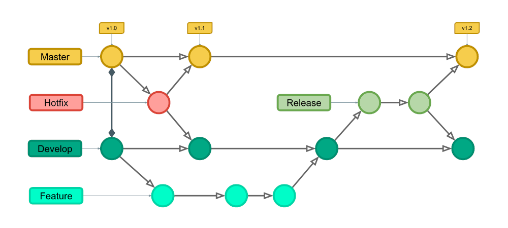

<div align="center">
  <a href="https://www.inteli.edu.br/">
    
  </a>
</div>

<br>

# Nome do Projeto: <TODO>

## Nome do Grupo: <TODO>

## Integrantes:

- <a href="https://www.linkedin.com/in/anna-riciopo/">Anna Giulia Marques Riciopo</a>  
- <a href="https://www.linkedin.com/in/danielaraujogonncalves/">Daniel Augusto de Araujo Gonçalves</a>  
- <a href="https://www.linkedin.com/in/joao-souza-campos/">João Victor de Souza Campos</a>  
- <a href="https://www.linkedin.com/in/lucas-brasil9/">Lucas Paiva Brasil</a>  
- <a href="https://www.linkedin.com/in/natalycunha/">Nataly de Souza Cunha</a>  
- <a href="https://www.linkedin.com/in/otavio-vasc/">Otávio de Carvalho Vasconcelos</a>  
- <a href="https://www.linkedin.com/in/thiagogomesalmeida/">Thiago Gomes de Almeida</a>


## Sumário

## Sumário

- [1. Introdução](#1-introdução)  
- [2. Estrutura de Arquivos e Pastas](#2-estrutura-de-arquivos-e-pastas)  
  - [2.1 Nome de Arquivos](#21-nome-de-arquivos)  
  - [2.2 Estrutura de Diretórios](#22-estrutura-de-diretórios)  
    - [2.2.1 Princípios Gerais](#221-princípios-gerais)  
    - [2.2.2 Estrutura de Diretórios](#222-estrutura-de-diretórios)  
    - [2.2.3 Observações Finais](#223-observações-finais)  
- [3. Política de Branches](#3-política-de-branches)  
  - [3.1 Visão Geral do Gitflow](#31-visão-geral-do-gitflow)  
  - [3.2 Estrutura de Branches](#32-estrutura-de-branches)  
    - [3.2.1 Branch de Desenvolvimento e de Documentação](#321-branch-de-desenvolvimento-e-de-documentação)  
    - [3.2.2 Diretrizes de Uso das Branches](#322-diretrizes-de-uso-das-branches)  
- [4. Políticas de Commit](#4-políticas-de-commit)  
  - [4.1 Descrição de Commits](#41-descrição-de-commits)  
- [5. Política de Push e Pull Requests](#5-política-de-push-e-pull-requests)  
  - [5.1 Políticas de Push](#51-políticas-de-push)  
  - [5.2 Políticas de Pull Requests](#52-políticas-de-pull-requests)  
    - [5.2.1 Nome de Pull Request (PR)](#521-nome-de-pull-request-pr)  
    - [5.2.2 Padrão de Escrita dos Pull Requests](#522-padrão-de-escrita-dos-pull-requests)  
- [6. Padrão para Imagens](#6-padrão-para-imagens)  
- [7. Referências](#7-referências)  


---

## 1. Introdução
&ensp; Este documento estabelece diretrizes claras para boas práticas no desenvolvimento de software, garantindo organização e qualidade do código. Todos os membros da equipe devem seguir as instruções definidas.

---

## 2. Estrutura de Arquivos e Pastas

### 2.1 Nome de Arquivos
- **Formato:** `snake_case` (sempre em inglês).
- **Regra:** Utilize nomes descritivos e curtos, evitando espaços e caracteres especiais.
- **Exemplo:**
  ```
  file_name.txt
  user_data.json
  ```

### 2.2 Estrutura de Diretórios
&ensp; A estrutura de diretórios do projeto deve ser organizada de forma modular, mantendo um equilíbrio entre granularidade e simplicidade. O objetivo é garantir fácil navegação, evitando a criação excessiva de diretórios desnecessários.

#### 2.2.1 Princípios Gerais  
1. **Organização por contexto:** Agrupar arquivos que compartilham um mesmo propósito dentro de uma estrutura coesa.
2. **Evitar diretórios desnecessários:** Só crie uma pasta quando houver mais de um arquivo relacionado a um mesmo contexto.
3. **Facilidade de localização:** Cada arquivo deve estar no diretório correspondente ao seu escopo funcional.

#### 2.2.2 Estrutura de Diretórios  

- **Arquivos de código:**
  - No diretório `pages/`, os arquivos `.tsx` das páginas ficam diretamente na pasta.
  - Caso uma página possua múltiplos arquivos auxiliares (como componentes específicos), uma pasta com o nome da página deve ser criada.
  - Exemplo:
    ```
    pages/home.tsx  
    pages/dashboard.tsx  
    pages/profile/index.tsx  # Criado porque profile possui mais de um arquivo
    pages/profile/avatar.tsx
    pages/profile/settings.tsx
    ```

- **Assets para documentação:**
  - Os assets utilizados na documentação devem ser organizados por **seções**.
  - Caso um tópico exija mais de um asset, deve-se criar uma **pasta dedicada**.
  - Exemplo:
    ```
    assets/section4/swot_analysis.png  
    assets/section4/4.1.6_personas/persona_pedro.png  
    assets/section4/4.1.6_personas/persona_paulo.png  
    ```

- **Componentes reutilizáveis:**
  - Os componentes de uso geral devem ser armazenados em `components/`.
  - Se um componente tiver arquivos auxiliares (ex.: estilos, testes), deve-se criar uma pasta para ele.
  - Exemplo:
    ```
    components/button.tsx  
    components/modal/index.tsx  # Criado porque modal possui múltiplos arquivos
    components/modal/styles.module.css  
    components/modal/modal_header.tsx  
    ```

#### 2.2.3 Observações Finais 
- Não criar pastas com um único arquivo dentro.
- Arquivos relacionados devem ser agrupados de maneira lógica.
- A estrutura deve ser modular, mas sem exageros na profundidade das pastas.

---

## 3. Política de Branches

### 3.1 Visão Geral do Gitflow
&ensp; O Gitflow é um modelo de branching que melhora o fluxo de trabalho no Git, organizando o desenvolvimento em diferentes branches. Ele auxilia no controle de versões e na colaboração eficiente entre desenvolvedores. A estrutura do Gitflow prevê branches específicas para desenvolvimento contínuo, correção de bugs e lançamentos.

<div align="center">
  <sub>Figura 1 - Estrutura do Gitflow</sub> <br>

  

  <sup>Fonte: <a href="https://www.alura.com.br/artigos/git-flow-o-que-e-como-quando-utilizar">Alura</a>.</sup>
</div>

&ensp; Esse diagrama ilustra como as diferentes branches interagem dentro do fluxo de trabalho do Gitflow. A branch `main` contém a versão estável do código, enquanto a `develop` serve como base para novas funcionalidades. As branches `feature`, `release`, `hotfix` e `bugfix` têm papéis específicos para garantir um ciclo de desenvolvimento organizado e eficiente.

### 3.2 Estrutura de Branches
Padrão de Nomenclatura das Branches:

- **Estrutura Geral:**  
  ```
  [tipo de branch]/[finalidade]/[nome-da-branch]
  ```

**Tipos de branch:**

> **main**: Contém o código pronto para produção.

> **develop**: Integração contínua das novas funcionalidades em desenvolvimento.

> **feature/[nome-da-feature]**: Para desenvolvimento de novas funcionalidades. Exemplo: `feature/integration_api`

> **bugfix/[nome-do-bug]**: Para correção de bugs. Exemplo: `bugfix/correct_login`

> **release/[versao]**: Preparação para lançamento de uma nova versão. Exemplo: `release/v1.0.0`

> **hotfix/[nome-do-hotfix]**: Correção urgente diretamente na produção. Exemplo: `hotfix/fix_bug_in_production`

#### 3.2.1 Branch de desenvolvimento e de documentação
&ensp; No contexto acadêmico, recebemos muitas demandas de documentação e, para isso, faz-se necessário a criação de um tipo extra de branch cujo gitflow não prevê. Abaixo está melhor detalhado este aspecto: 
- **`docs`** (documentação):  
  - **Padrão:** O nome deve ter o prefixo `docs`, seguido pela **seção e o título** a que a documentação se refere.  
  - **Exemplos:**  
    ```
    docs/2.1-propostas_e_solucoes  
    docs/4.1.2-analise_swot 
    ```

- **`dev`** (desenvolvimento):  
  - **Padrão:** Utiliza-se os tipos normais de branch do Gitflow.  
  - **Exemplos:**  
    ```
    bugfix/correct_login  
    feature/api_authentication  
    ```

#### 3.2.2 Diretrizes de Uso das Branches
- Cada nova funcionalidade deve ser desenvolvida em uma branch de feature criada a partir da branch develop.
- Os nomes de branch devem seguir os padrões de nomenclaturas de arquivos utilizando sempre o formato em `snake_case` e sempre em inglês.
- Commits diretos na branch main são proibidos!
- Travas foram adicionados no GitHub para impedir commits diretos na main e na develop, além de pushs diretos para main e develop.

---

## 4. Políticas de Commit
- Seguir o padrão "Conventional Commits" para manter um histórico organizado.
- Commits devem ser frequentes e descritivos.
- Proibido o uso de mensagens vagas como "melhorias".
- Foram adicionadas restrições no GitHub para impedir commits diretos na main e develop.

### 4.1 Descrição de Commits  
&ensp; A descrição de commits deve indicar de forma clara o que a alteração faz. Use frases curtas no **presente do indicativo**, pensando no efeito que o commit causa, como se começasse com: **"Se aplicado, este commit..."**. 

- **Padrão de Formatação:**  
  ```
  [tipo]: [descrição breve do que foi alterado]
  ```
- **Tipos mais comuns de commit:**  
  - `feat`: Adição de uma nova funcionalidade  
  - `fix`: Correção de um bug  
  - `refactor`: Refatoração de código sem alterar funcionalidade  
  - `style`: Alterações de estilo ou formatação (sem impacto funcional)  
  - `perf`: Otimizações de performance  
  - `test`: Adição ou atualização de testes  
  - `docs`: Alterações na documentação  
  - `chore`: Tarefas auxiliares (como atualização de dependências)

- **Exemplos:**  
  ```
  feat(client-list/filter): adiciona filtro por data na listagem de clientes  

  fix: corrige erro de validação no formulário de cadastro 

  refactor: reorganiza funções de utilidade em um arquivo separado  
  
  test(auth/login): adiciona testes unitários para o componente de login  

  style: remove espaços em branco no main.css  

  docs: adiciona seção de exemplos na documentação da API  

  chore(deps/build): atualiza dependências do projeto  

  perf: otimiza consulta de clientes para reduzir o tempo de resposta  
  ```

**Observação:** Se necessário, adicione comentários adicionais na descrição longa do commit (usando `git commit -m` e `-m` para múltiplas linhas).

---

## 5. Política de Push e Pull Requests

### 5.1 Políticas de Push
- Push direto para `main` e `dev` é proibido.
- Todas as mudanças devem passar por Pull Request.
- Foram adicionadas travas no GitHub para impedir push direto na main e develop, exigindo pull requests para qualquer mudança.

### 5.2 Políticas Pull Requests
- Todo PR deve ser revisado por pelo menos um membro. *Foi adicionada uma configuração no Github que garante isso.*
- Todas as discussões abertas devem ser resolvidas antes do merge. *Foi adicionada uma configuração no Github que garante isso.*
- Todo PR deve passar por testes automatizados.

#### 5.2,1 Nome de Pull Request (PR)
- **Formato:** `[tipo]: [descrição breve] #[número-da-task]`
- **Exemplo:**
  ```
  feat: adiciona filtro por data na listagem de clientes #21  
  ````

#### 5.2.1 Padrão de Escrita dos Pull Requests
&ensp; Cada Pull Request deve conter uma lista das mudanças implementadas. Exemplo:

```markdown
# Changelog

- Implementa autenticação de usuários com JWT;
- Adiciona página de cadastro com validação de dados;
- Corrige bug no carregamento de perfis de usuário;
- Melhora a responsividade do layout na tela de login.

closes: [#123](link da task no trello), [#124](link da task no trello).
```

---

## 6. Padrão para Imagens
- Evitar imagens grandes desnecessariamente.
- Sempre tilizar JPG para imagens que nãp precisam de camada de transparência.
- Imagens acima de 1MB devem ser comprimidas (salvo em casos de casos de GIF).
- Para imagens sem tantos detalhes, recomenda-se o uso de SVG.

---

## 7. Referências
- Conventional Commits: https://www.conventionalcommits.org/en/v1.0.0/
- GitFlow: https://nvie.com/posts/a-successful-git-branching-model/
- GitHub/iuricode: https://github.com/iuricode/padroes-de-commits
- Alura - GitFlow: https://www.alura.com.br/artigos/git-flow-o-que-e-como-quando-utilizar